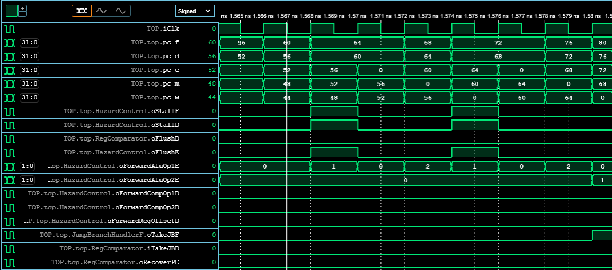
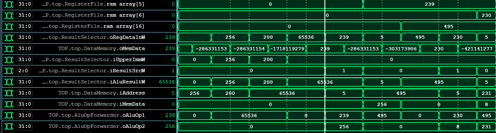

# Team-05 RISC-V CPU

## Table of Contents
1. [Directory Information](#1-directory-information)
2. [Design Process](#2-design-process)
   - [Task Allocation](#21-task-allocation)
   - [Style and Naming](#22-style-and-naming)
   - [Note On Custom Logic Types](#23-note-on-custom-logic-types)
   - [Design Principles](#24-design-principles)
3. [About The CPU](#3-about-the-cpu)
   - [Overview](#31-overview)
   - [Single Cycle Architecture](#32-single-cycle-architecture)
   - [Pipelined Architecture](#33-pipelined-architecture)
   - [Limitations](#34-limitations)
4. [Contributing](#4-contributing)
5. [Contact](#5-contact)
6. [Acknowledgements](#6-acknowledgements)

---

<br>

# (1) Directory Information


## (1.0) Repository Branch Descriptions : 

The tables below describes the usage of various branches for development and deployment purposes


**Table(1.0.1) :** Assessed/Deployment Repository Branches

---
| Branch |  Purpose | Verified Functionality |
|----------|-------------|----------|
| Single-Cycle-CPU  | Holds the files corresponding to the Single Cycle implementation of the CPU  |  Fully Tested and Verified|
| Pipelined-CPU    | Holds the files corresponding to the Pipelined version of the CPU that implements static branch prediction and hazard handling | Majority Tested and Verified|
|  Cache_And_Pipeline   | Holds the files corresponding to the Pipelined CPU with an additional Data Cache Impelmentation | Partly Tested and Verified| 
| main    | Holds repository information | |

---

<br>

**Table(1.0.2) :** Development Purpose Repository Branches

---
| Branch |  Purpose | Verified Functionality |
|----------|-------------|----------|
| Control-Unit  | Holds the files corresponding to the Single Cycle implementation of the CPU  |  Fully Tested and Verified|
| control-unit   | Holds the files corresponding to the Pipelined version of the CPU that implements static branch prediction and hazard handling | Majority Tested and Verified|
|  compiling-solution   | Holds the files corresponding to the Pipelined CPU with an additional Data Cache Impelmentation | Partly Tested and Verified| 
| Pipeline-Architecture-Dev    | Holds repository information | |

---


## (1.1) Directory Organisation : 

```
-rtl
--Control
```


# (2) Design Process

## (2.0) Task Allocation

### (2.0.1) Single Cycle CPU
 #### **Arithmetic Logic Unit** 
 - Sam Barber 

 #### **Control**
 - Dima Askarov

 #### **Memory**
  - **Instruction Memory :**
    - Dima Askarov
  - **Data Memory :**
    - Lolezio
    - Dima Askarov 

 #### **Multiplexers**

 #### **Program Counter**

 #### **Testing**

<br>

## (2.1) Design Principles

The driving design principles throughout the development of components for the Single Cycle CPU and the Pipelined CPU were the following :

>- **Modularity** : Components were broken down into specialised units that performed a singluar or a limited set of tasks

>- **Ease of intergration and development** : The ability to easily integrate sub modules together was always a key consideration during design and development

>- **Transparency of operation** : The ability to easily interpret and understand the operation of modules and sub-modules was the main consideration when implementing them. The implications of this approach on the efficiency and cost of the design is explored in *Limitations*

<br>

## (2.2) Style and Naming

In order to allow quick and clear development, naming conventions and styles were upheld throughout the design and development of modules. The naming conventions and styles used in this project are listed below

**Table (2.2.1)** : Style and Naming Conventions

---
| Subject |  Style/Naming Guide | Example |
|----------|-------------|----------|
| Module Names   | CamelCase and Pipeline Stage Identifier Suffix (To indicate in which pipeline stage the module operates $(F,D,E,M,W)$)  |  `ControlPathD` - Control Path Module in the Decode Stage|
| Input Signals     | CamelCase, Input Identifier Pre-Fix and Optional Pipeline Stage Operation Suffix |   `iInstructionTypeE` - An input of Instruction type from the execution stage  <br> `iClk` - Clock signal input|
| Output Signals    | CamelCase, Output Identifier Pre-Fix and Optional Pipeline Stage Operation Suffix  | `oRecoverPC` - Output Flag to Indicate Incorrect Branch <br> `oTakeJBD` - Output Flag into the Decode stage to indicate that a jump/branch has been taken  | 
| Internal Logic Signals    | Snake case with a Pipeline Stage Identifier Suffix (only in top sheet) | `instruction_type_e` - Type of Instruction Executing in the Execute Stage <br> `reg_data_in_w` - Data Written Back Into Register File From the Write-Back Stage | 
| Pipeline Register Naming| CamelCase with a Pipeline Stage Identifier Prefix and Suffix| `DPipelineRegisterE` - Pipeline Register Taking Signals From Decode Stage and Outputing Them Into The Execution Stage |

---

## (2.3) Note On Custom Logic Types

To increase the readability of modules and make their operation more transparent and understandable, frequently used control and data signals were encoded into custom logic types using enums and unions. 

These logic types are defined in the 'ControlTypeDefs.svh' file that is included in each module that utilises the respective logic types - shown in **Listing (1.2.1)**.

**Listing (2.3.1)** : Include header example

```verilog
`include "include/ControlTypeDefs.svh" //Include Header
```

<br>

**Table (2.3.1)** Shows the definition of the enum InstructionTypes. This enum was used to store the type of instruction executing as decoded by the control unit. Using this enum made the modules easier to understand as the viewer could easily tell what specific instruction would trigger a given set of outputs. 

**Table (2.3.2)** : Enum - InstructionTypes Definition

---
| InstructionTypes[3:0] |  Enum Value | Note |
|----------|-------------|----------|
| BRANCH   | 0000  | **Branch Instruction** (b-type)|
| LOAD     | 0001 | **Load Instruction** (i-type) |
| STORE    | 0010 | **Store Instruction** (s-type) | 
| UPPER    | 0011 | **Upper Instruction** (u-type)| 
| IMM_COMPUTATION | 0100 | **Register-Immediate Computation** : An instruction that performs logical/arithmetic operations on an immediate and register value | 
| REG_COMPUTATION | 0101 | **Register-Register Computation** : An instruction that performs logical/arithmetic operations on two register values  | 
| JUMP    | 0110 | **Jump Insturction** (j-type) | 
| NULLINS | 1111 | **NULL** : Used to represent 'no-instruction'. Helps determine when the decoding of a given isntruction word has failed |
---

<br>


To further classify a given instruction, a union InstructionSubType was implemented. At any given time, this union would take on the value of an enum type representing the specific instruction sub type. The definition of the 'TypeR' enum is shown in **Table (2.3.4)** as example. For the case of an r-type class of instructions, the InstructionSubTypes union would take on the enum value of the specific r-type instruction.

<br>

**Table (2.3.3)** : Enum - TypeR Definition

---
| TypeR[3:0] |  Enum Value | Note |
|----------|-------------|----------|
| ADD   | 0000  | **Register Addition** |
| SUB   | 0001 | **Register Subtraction** |
| SHIFT_LEFT_LOGICAL | 0010 | **Logical Shift Left** | 
| SET_LESS_THAN      | 0011 | **Set Less Than** | 
| USET_LESS_THAN     | 0100 | **Set Less Than Unsigned** |
| XOR | 0101 | **Bit-Wise XOR of Register Operands** | 
| SHIFT_RIGHT_LOGICAL | 0110 | **Logical Shift Right**  | 
| SHIFT_RIGHT_ARITHMETIC    | 0111 | **Arithmetic Shift Right** | 
| OR | 1000 |**Bit-Wise OR of Register Operands** |
| AND    | 1001 | **Bit-Wise AND of Register Operands** | 
| NULL_R    | 1111 |  **NULL** : Used to represent 'no-instruction'. Helps determine when the decoding of a given isntruction word has failed | 
---

<br>


**Table (2.3.4)** : Union - InstructionSubTypes Definition

---
| InstructionSubTypes[3:0] | Value |
|----------|----------|
| TypeR    | **Register-Register Instruction Type** |
| TypeI    | **Register-Immediate Instruction Type** |
| TypeU    | **Upper Instruction Type** | 
| TypeS    | **Store Instruction Type** | 
| TypeJ    | **Jump Instruction Type** |
| TypeB    | **Branch Instruction Type** | 
| NULL     | **NULL :** Helps determine when decoding the instruction sub type has failed  |  
---

<br>

**Listing(2.3.2) :** Example of instruction type and sub type assignment in InstructionDecode module given the instructin OpCode, funct3 and funct7 values

```verilog
  TypeR r_type;
  TypeI i_type;
  TypeU u_type;
  TypeS s_type;
  TypeJ j_type;
  TypeB b_type;

  InstructionTypes instruction_type;

always_comb begin
  case(iOpCode)

      7'd51 : begin
        instruction_type = REG_COMMPUTATION;
        
        i_type = NULL_I;
        u_type = NULL_U;
        s_type = NULL_S;
        j_type = NULL_J;
        b_type = NULL_B;
        
        case(iFunct3)

          3'b000  : begin
            if      (iFunct7 == 7'b0000000) r_type = ADD;
            else if (iFunct7 == 7'b0100000) r_type = SUB;
            else                            r_type = NULL_R;
          end

          3'b001  : r_type = SHIFT_LEFT_LOGICAL;
          3'b010  : r_type = SET_LESS_THAN;
          3'b011  : r_type = USET_LESS_THAN;
          3'b100  : r_type = XOR;
          
          3'b101  : begin
            if      (iFunct7 == 7'b0000000) r_type = SHIFT_RIGHT_LOGICAL;
            else if (iFunct7 == 7'b0100000) r_type = SHIFT_RIGHT_ARITHMETIC  ;
            else                            r_type = NULL_R;
          end

          3'b110  : r_type = OR;
          3'b111  : r_type = AND;    

        endcase
      end

  endcase
end
```

<br>

**Listing(2.3.4) :** Example usage of InstructionTypes enum and InstructionSubTypes union in producing control signals

```verilog
  always_comb begin

    //Initialise Output Signals
    oRegWrite   = 1'b0;
    oAluSrc     = 1'b0;
    oPCSrc      = 1'b0;
    oResultSrc  = 3'b000;
    oMemWrite   = 1'b0;

    case(iInstructionType)

      REG_COMMPUTATION : oRegWrite = 1'b1;


      IMM_COMPUTATION  : begin
        oRegWrite = 1'b1;
        oAluSrc   = 1'b1;
      end


      LOAD   : begin
        oRegWrite  = 1'b1;
        oResultSrc = 3'b001;
      end


      UPPER  : begin
        if (iInstructionSubType == LOAD_UPPER_IMM) begin
          oRegWrite  = 1'b1;
          oAluSrc    = 1'b1;
          oResultSrc = 3'b011;
        end

        else begin
          oResultSrc = 3'b100;  //Data written to register will come from the PC adder
          oPCSrc     = 1'b0;    //PC increments by 4
        end
      end
```

<br>


---

<br>

# (3) About The CPU

## (3.1) Overview

**Table(3.1.1) :** Implemented Instructions

---
| Instruction Type | Implemented Instructions|
|------------------|-------------------------|
| R-Type | Add, Sub <br> Logical Shift Left <br> Set Less Than, Set Less Than Unsigned <br> XOR <br> Shift Right Logical, Shift Right Arithmetic <br> OR  <br> AND  |
| I-Type | Load Byte, Load Half, Load Word <br> Load Byte Unsigned, Load Half Unsigned <br> Add Immediate <br> Logical Shift Left Immediate <br> Set Less Than Immediate, Set Less Than Immediate Unsigned <br> XOR Immediate <br> Shift Right Logical Immediate, Shift Right Arithmetic Immediate <br> OR Immediate <br> AND Immediate|
| U-Type | Load Upper Immediate <br> Add Upper Immediate PC |
| S-Type | Store Byte, Store Half, Store Word <br> Store Byte Unsigned, Store Half Unsigned|
| J-Type | Jump And Link <br> Jump And Link Register| 
| B-Type | Branch Equal To <br> Branch Not Equal To|

---

<br>

> *The decision to leave out the other branch instructions was made to reduce the complexity of the CPU. If accurate implementations of other branch instructions were to be made, like BGE, the use of additional flags that indicate arithmetic overflow may have been needed to determine the branch condition outcome.*

---

<br>


## (3.2) Single Cycle Architecture

Our implementation of the single cycle CPU is split in 5 main stages. 

**Table ()** : 

---

|      Stage      |  Operation | Relevant files |
|-----------------|----------------------------|-------------|
|      $Fetch$    | The Program Counter is incremented by the right amount, so that the correct next instruction is fetched |[PCAdder.sv](PCAdder.sv)   [PCRegister.sv](PCRegister.sv) [InstructionMemory.sv](InstructionMemory.sv)|
|      $Decode$   | The instruction is fully decoded to generate required control signals. During this stage the source registers are also read on the falling edge of the clock | [AluEncode.sv](AluEncode.sv) [ControlDecode.sv](ControlDecode.sv)  [ControlPath.sv](ControlPath.sv)  [ControlUnit.sv](ControlUnit.sv)  [ImmDecode.sv](ImmDecode.sv)  [InstructionDecode.sv](InstructionDecode.sv) [RegisterFile.sv](RegisterFile.sv) |
|     $Execute$   | The Arithmetic Logic Unit executes the computation specified by the instruction (includes no computation at all) | [Alu.sv](Alu.sv) |
|      $Memory$   | In the memory access stage the data memory is either read from or written to given the control signals in the memory stage| [DataMemory.sv](DataMemory.sv) |
|      $Write$    | The final result chosen between; the Alu output, memory data, Upper immediate, PC+4 and PC + Upper Immediate, is written to the register file on the rising edge of the clock| [ResultMux.sv](ResultMux.sv) |

---

### (3.2.1) Fetch Stage
#### (3.2.1.1) PC Register
The Fetch stage begins with the output of the next PC value, so that the next instruction can be fetched. This is implemented in [PCRegister.sv](PCRegister.sv) with the line:
```verilog
   if (iPCSrc == 1'b0) PCNext = iPCSrc ? iBranchTarget : oPC + 32'd4;
```
Depending on the value of PCSrc, the next PC value is either PC + 4 or PC + ImmExt (calculated as BranchTarget. PC + 4 would simply indicate the next instruction, since each 32 bit instruction word is stored in 8 memory locations, as seen below:

**Table ()** : 

---
| Cell 3 |  Cell  2 | Cell  1 | Cell  0 | Address |
|--------|----------|---------|---------|---------|
|8 bytes |  8 bytes | 8 bytes | 8 bytes |  0x004  |
|8 bytes |  8 bytes | 8 bytes | 8 bytes |  0x003  |
|8 bytes |  8 bytes | 8 bytes | 8 bytes |  0x002  |
|8 bytes |  8 bytes | 8 bytes | 8 bytes |  0x001  |
|8 bytes |  8 bytes | 8 bytes | 8 bytes |  0x000  |

---

The PC value maps to the address. When PC is 0, this will map to the first address, and the 4 bytes, forming one instruction word, will be outputted out of Instruction Memory. As such, PC + 4 corresponds to the next address.

<br>

#### (3.2.1.2) PC Adder
When Jump or Branch instructions are carried out, the next instruction that must be carried out is not always the next one stored in memory. The next address must therefore be calculated, which is found using [PCAdder.sv](PCAdder.sv). 
<br>

The PC Adder receives the current instruction type from the Control Unit (see below), and executes the following logic:
<br>

**Table ()** : 

---
| Instruction Type |  Instruction SubType | Output PC Target |
|------------------|----------------------|------------------|
|  JUMP  |  JUMP AND LINK REGISTER      | ImmExt + RegOffset  | 
|  JUMP  |  ANY OTHER  | PC + ImmExt |
| BRANCH | ANY    | PC + ImmExt |

---

When the current instruction is a simple Branch or Jump, the next PC value is calculated by the value of ImmExt (see below), to give the correct next address. However, when the instruction is JALR, an offset can be specified. Since the value of this offset already contains the value of PC, ImmExt is once again added, so that the correct next address is found. 
<br>
#### (3.2.1.3) Instruction Memory
Instruction Memory was built to take in a PC value, corresponding to the address of the Instruction, and output it immediately, implemented in [InstructionMemory.sv](InstructionMemory.sv). It is not clocked, since PC Register already ensures that the value is for the correct clock cycle. 
<br>
The Read Only Memory (ROM) is implemented using the line:
```verilog
   logic [DATA_WIDTH - 1 : 0] rom_array [0 : 2**12  - 1];
```
The address space corresponding to the corresponding to the memory map in the brief, meaning up to 1024 instruction words can be loaded. This can however easily be extended.
<br>
The ROM outputs an instruction word, by concatenating the 4 individual bytes of the instruction word into a single, 32 bit value:
```verilog
   oInstruction = {rom_array[iPC + 32'd3][7:0], rom_array[iPC + 32'd2][7:0], rom_array[iPC + 32'd1][7:0], rom_array[iPC][7:0] };
```
<br>
This instruction is then decoded in the Control Unit.

### (3.2.2) Decode Stage
#### (3.2.2.1) Control Unit
The Control Unit was split into many smaller modules, to help with debugging and understanding the processes.
<br>
The instruction word out of Instruction Memory is first split into the Op Code and 2 Funct values, so that the Instruction Type and Subtype can be decoded. This is first done in [ControlPath.sv](ControlPath.sv)
<br>
To extract the correct data, the instruction outputted from Instruction Memory is simply indexed:
```verilog
always_comb begin
    op_code = iInstruction[6:0];
    funct7  = iInstruction[31:25];
    funct3  = iInstruction[14:12];
end
```
Additional logic also outputs the constant values to be stored in the Register file in this block (see below)
<br>
Next, the Operation Code, and Function 3 and 7 are passed into [InstructionDecode.sv](InstructionDecode.sv) so they can be decoded into the custom types (see above) InstructionType and InstructionSubType.
<br>
The following logic is implemented using a case statement, to determine the Instruction Type, in the Instruction Decoder. Decimal numbers are used as they are more readable:

**Table ()** : 

---

| OpCode |  Instruction Type     | Instruction Sub Type |
|--------|-----------------------|----------------------|
|  51    |  Register Computation | Depends on Funct3 and Funct7 |
|  19    | Immediate Computation | Depends on Funct3 and Funct7 |
| 3      | Load    | Depends on Funct3 |
| 23     | Upper | Add Unsigned PC |
| 55     | Upper | Load Unsigned Immediate |
| 103    | Jump | Jump and Link Register | 
| 111    | Jump | Jump and Link |
| 99     | Branch | Depends on Funct3 |
| 35     | Store  | Depends on Funct3 |

---

Once the Instruction Type is determined, for Register Computation, Immediate Computation, Load, Branch, and Store, the Instruction Sub Type is determined depending on Funct3 and Funct 7, with further case statements:

**Table (): Register Computation** : 
---

| Funct3 |  Funct7    | Instruction Sub Type |
|--------|------------|----------------------|
|  000   |  0000000 | Add |
|  000   |  0100000 | Subtract |
|  001   |  Any     |Shift Left Logical|
|  010   |  Any     | Less Than |
|  011   |  Any     | Unsigned Less Than |
|  100   | Any      | XOR | 
|  101   | 0000000 | Shift Right Logical |
|  101   | 0100000 | Shift Right Arithmetic |
|  110     | Any  | OR |
|  111     | Any  | AND |

---

**Table (): Immediate Computation** : 
---

| Funct3 |  Funct7    | Instruction Sub Type |
|--------|------------|----------------------|
|  000   |  Any | Add Immediate |
|  001   |  Any     | Shift Left Logical Immediate |
|  010   |  Any     | Less Than Immediate |
|  011   |  Any     | Unsigned Less Than Immediate |
|  100   | Any      | XOR Immediate | 
|  101   | 0000000 | Shift Right Logical Immediate |
|  101   | 0100000 | Shift Right Arithmetic Immediate|
|  110     | Any  | OR Immediate|
|  111     | Any  | AND Immediate |

---

**Table (): Load** : 
---

| Funct3 | Instruction Sub Type |
|--------|----------------------|
|  000   |  Load Byte |
|  001   |  Load Half Word |
|  010   |  Load Word |
|  100   |  Load Upper Byte | 
|  101   | Load Upper Half |

---

**Table (): Branch** : 
---

| Funct3 | Instruction Sub Type |
|--------|----------------------|
|  000   | Branch if Equal (BEQ) |
|  001   | Branch if not Equal (BNE) |
|  100   |  Branch if less than (BLT) |
|  101   |  Branch if greater or equal (BGE) | 
|  110   | Branch if less than unsigned (BLTU) |
|  111   | Branch if greater or equal than unsigned (BGEU) |

---

**Table (): Store** : 
---

| Funct3 | Instruction Sub Type |
|--------|----------------------|
|  000   | Store Byte |
|  001   | Store Half Word |
|  010   | Store Word |

---

<br>
Once the Instruction Type and Sub Type have been determined, the immediate operand must also be decoded, so it can be used by the ALU, or as a PC offset for Jump and Branch instructions. It is also sign extended, by setting all ImmExt[31:12] equal to the 12th bit ImmExt[11]. Once again, a case statement is used to determine this based on the Instruction Type determined previously, following this logic:

**Table ()** : 
---

| Instruction Type | ImmExt |
|------------------|--------|
| Immediate Computation | Load Instruction[31:20] in ImmExt[11:0]|
|  Load   | Load Instruction[31:20] in ImmExt[11:0] |
|  Upper   | Set ImmExt[11:0] to 0, and load Instruction[31:20] in ImmExt[31:12] |
| Store    | Load Instruction[11:7] in ImmExt[4:0], Instruction[31:25] in ImmExt[11:5] |
| Jump and Link | Load Instruction[31:20] in ImmExt[11:0] | - Here, the offset will be calculated separately
| Jump | Set ImmExt[0] to 0, load Instruction[30:21] in Immext[10:1], load Instruction[20] in ImmExt[11], load Instruction[19:12] in ImmExt[19:12], and set ImmExt[31:20] to the value of Instruction[31] | - Setting ImmExt[0] ensures the address is a multiple of 2
|Branch | Set ImmExt[0] to 0, load Instruction [11:8] in ImmExt[4:1], concatenate Instruction[31], Instruction[7] and Instruction[30:25] in ImmExt[12:5], and set all ImmExt[31:13] to Instruction[31] | - Instruction already contains the location of the jump

---

<br>

Once the Immediate operand ImmExt has been determined, further control signals are determined in [ControlDecode.sv](ControlDecode.sv). This decoder once again comprises a case statement, looking at each Instruction type, and setting ResultSrc, AluSrc, RegWrite and MemWrite. They have the following purpose:

**Table ():**

---

| Control Signal | Purpose |
|--------|----------------------|
|  ResultSrc   | Determines which result is written back in the register file (see below) |
|  AluSrc   | Determines the source of the ALU inputs (see below) |
|  RegWrite   | Determines whether the register file must be written or not (see below) |
| MemWrite | Determines whether the data must be written to memory or not (see below) |

---

The case statement implementing these results implements the following logic:

**Table ():**

---

| Instruction Type | ResultSrc |  AluSrc  |  RegWrite  | MemWrite |
|--------|----------------------|---------|------------|----------|
|  Register Computation   | 000 | 0 |  1 | 0 |
|  Immediate Computation   | 000 | 1 | 1 | 0 |
|  Load   | 001 | 1  | 1 | 0|
| Load Upper Immediate | 011 | 1 | 1 | 0 | 
| Upper | 100 | 0 | 0 | 0 |
| Store | 000 | 1 | 0 | 1 |
| Jump  | 010 | 0 | 1 | 0 | 

---

<br>

Finally, the Control Unit must determine what operations the ALU must conduct based on the Instruction type, but more importantly, the Sub Type, which is once again implemented using a case statement, with the following logic (in the implementation, the custom enum values corresponding to the operations were used, but for simplicity, here we have them in binary format):

> Note that the Instruction Sub Types, while being part of different Instruction Types, require the same ALU operations, and so here only the Sub Types are shown.

**Table ():**

---

| Instruction Sub Type | AluCtrl |
|----------------------|---------|
| Add  | 0000 |
| Sub  | 0001 |
| Shift Left Logical  | 0010 |
| Set Less Than | 0011 |
| Unsigned Set Less Than | 0100 |
| XOR | 0101 |
| Shift Right Logical | 0110 |
| Shift Right Arithmetic | 0111 |
| OR | 1000 |
| AND | 1001 |

---

#### (3.2.2.2) Register File


## (3.3) Pipelined Architecture

As with the Single Cycle Architecture, the pipeline architecture broke down the instruction execution cycle into 5 stages. The stages were chosen as the following : 

**Table ()** : 

---
| Pipe Line Stage |   Name       | Operation |
|-----------------|----------------------------|-------------|
| $F/D_{jb}$   | $Fetch/Decode \ Jump -Branch$  | The instruction is fetched and partly decoded to determine if a branch or jump type (only JAL) instruction is executing. In the case of a branch or jump the required control signals are generated (ie. setting $PC = JTA$) |
| $D$     | $Decode$ | The instruction is fully decoded to generate required control signals. During this stage the source registers are also read on the falling edge of the clock |
| $E$    | $Execute$ | The Arithmetic Logic Unit executes the computation specified by the instruction (includes no computation at all) | 
| $M$    | $Memory$ | In the memory access stage the data memory is either read from or written to given the control signals in the memory stage| 
| $W$ | $Write \ Back$ | The final result chosen between; the Alu output, memory data, Upper immediate, PC+4 and PC + Upper Immediate, is written to the register file on the rising edge of the clock| 

---

<br>

<br>

>*Note that the JALR instruciton is dealt with in the main $DECODE$ stage and only the JAL instruction is resolved in the $F/D_{jb}$ stage.* 

>*This is because, if $JALR$ was to be decoded and acted upon in the $F/D_{jb}$ stage, then a data dependancy between the previous instruction and the $JALR$ source register would require further forwarding all the way back to the $F/D_{jb}$ stage - instead of adding additional hardware and complexity, the choice of leaving $JALR$ for the main $DECODE$ stage was made.* 

>*This means however, that for every $JALR$ instructions, the decode stage has to be flushed and the $JTA$ instruction has to be fetched (giving a waste in a cycle)*

---

<br>

## Key Features

### Hazard Handling


#### Load Data Dependency
- **Issue**: If a load instruction is in the Execute stage (`iInstructionTypeE == LOAD`), and its destination register matches a source register in the Decode stage, a data hazard occurs.
- **Resolution**: The Fetch, Decode, and Execute stages are stalled, and the Execute stage is flushed.

#### Branch Instructions (RAW Hazards)
- **Issue**: Occurs when an instruction in the Decode stage is dependent on the result of an instruction in the Memory stage.
- **Resolution**: Forwarding is applied if there is no load instruction in the Memory stage. If there is a load, the Fetch, Decode, and Execute stages are stalled, and the Execute stage is flushed.

#### General RAW Hazards
- **Issue**: Occurs when a source register in the Execute stage is about to be written in the Memory or Write Back stages.
- **Resolution**: Data is forwarded from the Memory or Write Back stage to the Execute stage.

<br>

#### Forwarding Logic

   | Instruction Stage | Forwarding Condition | Action |
   |-------------------|----------------------|--------|
   | Execute           | Source register in Execute matches destination in Memory/Write Back | Data is forwarded to prevent stall |
   | Decode            | Source register in Decode matches destination in Memory | Data is forwarded for comparison operations |


#### Stall and Flush Logic

   | Instruction Stage | Forwarding Condition | Action |
   |-------------------|----------------------|--------|
   | Execute           |**Load Dependancy :** The instruction in the Execute stage is a load, and it writes to either one of the source registers in the Decode stage  | Pipeline is stalled at the Fetch and Decode stages, and the Execute stage is flushed to avoid using incorrect data. |
   | Decode            | **Branch Data Dependancy :** For branch instructions in the Decode stage, if either of the two source registers are to be written to by an instruction in the Executin stage, | Pipeline is stalled, and the Execute stage is flushed on the next cycle. This gives time for the instruction previously in the Execution stage to reach the Memory stage where the output of the Execution stage can be forwarded to the Decode stage.|

---


<br>

### Static Branch Prediction
---

In an attempt to reduce the CPI of the pipelined CPU and increase its' efficiency, the choice to implement static branch prediction was made. 

<br>

> **Static Branch Prediction :** The CPU will always take the branch if it is to be taken backward (ie. the branch target address is less than the current address). This can improve the processors' performance as 'for' and 'while' loops, which are blocks of code that execute many times, are typically implemented using a branch instruction, thus in a programme utilising loops, the probability that a given branch instruction will indeed branch backwards is higher than the inverse. 

>This means if you predict a branch outcome before the decode stage such that backward branches are always taken, you can save many clock cycles that would be used to flush out the incorrectly fetched instructions.

<br>

To accomodate for static branch prediction, a part of the instruction had to be decoded within the fetch stage to determine if its a branch or jump.

In the case of a branch that is to be taken backwards, the module `JumpBranchHandlerF` would create the branch target address using the current PC value in the fetch stage and the instruction word.


#### Edge Cases and Stalls

In the case that the branch taken backwards resolves to be incorrect (ie. branch was taken backward when it should not have been), the `ComparatorD` module will detect the incorrect prediction by comparing the two source registers of the branch instruction within the main $DECODE$ stage - alongside additional information on the branch prediction made in the fetch stage.

**Listing() :** Example in `ComparatorD` of incorrect branch prediction detection based on the value of source registers and branch decision in the previous stage

```verilog
  case(iInstructionTypeD)

    BRANCH : begin

      case(iJBTypeD)

        BEQ : begin

         // If registers are equal and we didnt take the branch
          if      (iRegData1D == iRegData2D & iTakeJBD == 1'b0) begin 
            oPCSrcD    = 1'b1;
            oFlushD    = 1'b1; 
            oRecoverPC = 1'b0; 
          end 

         // If registers aren't equal and we did take the branch
          else if (iRegData1D != iRegData2D & iTakeJBD == 1'b1) begin 
            oPCSrcD    = 1'b1;
            oFlushD    = 1'b1; 
 //If we have branched when we were not supposed to -> must recover PC of instruction after BEQ
            oRecoverPC = 1'b1;
          end

//This covers the registers being equal and branch being taken or registers being not equal and branch not taken
          else begin 
            oPCSrcD    = 1'b0;
            oFlushD    = 1'b0;
            oRecoverPC = 1'b0;
          end
          
        end
```

## 


## (3.4) Demonstration

This section documents the results of reference programs and the F1 lighting sequence program on the different CPU architectures

### (3.4.1) Hazard Handling and Forwarding 

The images below document the following assembly code being run on the pipelined CPU :

```assembly
_loop2:                     # repeat
    LI      a4, max_count   # PC = 48
    ADD     a5, a1, a2      # PC = 52   a5 = data base address + offset
    LBU     t0, 0(a5)       # PC = 56   t0 = data value
    ADD     a6, t0, a3      # PC = 60   a6 = index into pdf array
    LBU     t1, 0(a6)       # PC = 64   t1 = current bin count
    ADDI    t1, t1, 1       # PC = 68   increment bin count
    SB      t1, 0(a6)       # PC = 72   update bin count
    ADDI    a2, a2, 1       # PC = 76   point to next data in array
    BNE     t1, a4, _loop2  # PC = 80   until bin count reaches max
    RET                     # PC = 84
```

In the code above, there are data dependancies between the following instructions : 
- `ADD a5, a1, a2` and `LBU t0, 0(a5)`: 
  -  The `LBU` instruction uses `a5` as an operand, which is set by the preceding `ADD` instruction. This is a Read After Write (RAW) hazard, as `LBU` reads the value of `a5` immediately after it's written.

<br>

- `LBU t0, 0(a5)` and `ADD a6, t0, a3`: 
  - The `ADD` instruction uses `t0`, which is loaded by the preceding `LBU` instruction. This is another RAW hazard, as `ADD` requires the value in `t0` that `LBU` has just loaded.

<br>

- `ADD a6, t0, a3` and `LBU t1, 0(a6)`: 
  - The `LBU` instruction uses `a6` as an operand, which is calculated by the preceding `ADD` instruction. This is again a RAW hazard.

<br>

- `LBU t1, 0(a6)` and `ADDI t1, t1, 1`: 
  - The `ADDI` instruction modifies `t1`, which holds the value loaded by the preceding `LBU` instruction. This is a RAW hazard as `ADDI` needs the value from `LBU`.

<br>

- `ADDI t1, t1, 1` and `SB t1, 0(a6)`: 
  - The `SB` (store byte) instruction uses the value in `t1` that was just modified by `ADDI`. This is another RAW hazard.

<br>


<br>

**The simulation image below shows the following pipeline state :** 

| Stage | Instruction | PC |
|-------|-------------|----|
| $Fetch/Decode$ | `LBU t1, 0(a6)`|  64  |
| $Decode$ | `ADD a6, t0, a3`|  60  |
| $Execute$ | `LBU t0, 0(a5)`|  56  |
| $Memory-Access$ | `ADD a5, a1, a2`|  52  |
| $Write-Back$ | `LI a4, max_count`|  48  |

<br>

**Figure(3.4.1(1)) :** Stall and Flush Demonstration


<br>

As the instruction in the decode stage is being decoded (`ADD a6, t0, a3`), the hazard unit detects its' dependancy with the load instruction in the Execute stage - as a result it sets the stall and flush flags to allow some time for the load instruction to propagate to the write-back stage, where the result can be forwarded. The logic performing this is shown below : 

<br>

```verilog
    if (iInstructionTypeE == LOAD) begin 
      if (iDestRegE == iSrcReg1D | iDestRegE == iSrcReg2D) begin //Load Dependancy Detected
        oStallF = 1'b1;
        oStallD = 1'b1;
        oFlushE = 1'b1; e
      end  
    end
```

This is seen happenening in **Figure(3.1.1(1))**, where the `oStallF`, `oStallD` and `oFlushE` are output as high from the hazard unit - with the the execution stage being flushed on the next clock cycle (PC and all other signals go to 0)

In the same cycle, the hazard unit also detects the dependancy between the `ADD a5, a1, a2` in the Memory stage and `LBU t0, 0(a5)` in the Execute stage. **Figure(3.1.1(1))** shows the `iForwardAluOp1` being set to $01$ in binary - indicating that the destination registster in the memory stage is the same as the source 1 register in the execute stage. The logic that performs this in the `HazardUnit` is shown below :


```verilog
      //If destination register in memory stage is the same as source1 register in execution stage
      if      (iSrcReg1E != 5'b0 & iRegWriteEnM & iDestRegM == iSrcReg1E) begin
        if (iInstructionTypeM != UPPER) oForwardAluOp1E = 2'b01;
        else                            oForwardAluOp1E = 2'b11;    //Forward writeback value to execution stage
      end

      else if (iSrcReg1E != 5'b0 & iRegWriteEnW & iDestRegW == iSrcReg1E) begin
        if (iInstructionTypeM != UPPER) oForwardAluOp1E = 2'b10;
        else                            oForwardAluOp1E = 2'b11; 
      end

      else                              oForwardAluOp1E = 2'b00;    //If there is no data dependancy hazard for source register 1

      //If destination register in memory/writeback stage is the same as source register in execution stage
      if      (iSrcReg2E != 5'b0 & iRegWriteEnM & iDestRegM == iSrcReg2E) oForwardAluOp2E = 2'b01;     
      else if (iSrcReg2E != 5'b0 & iRegWriteEnW & iDestRegW == iSrcReg2E) oForwardAluOp2E = 2'b10;     
      else 
```

As a result, the `alu_op1_e` (alu operand 1 in the execute stage) is equal to 65538 (decimal) which is the value that is about to be written to `ram_array[15]` (register 15 - a5) on the next clock cycle (its' current value is 0)

---

<br>

**The simulation image below shows the following pipeline state :**

| Stage | Instruction | PC |
|-------|-------------|----|
| $Fetch/Decode$|`LBU t1, 0(a6)`| 64 |
| $Decode$ | `ADD a6, t0, a3`|  60  |
| $Execute$ | `NULL`|  0  |
| $Memory-Access$| `LBU t0, 0(a5)`|  56  |
| $Write-Back$| `ADD a5, a1, a2`|  52  |

<br>

**Figure(3.1.1(2)) :** Forwarding and Flushing Demonstration 1


**Figure(3.1.1(2))** shows the `LBU t0, 0(a5)` in the Memory stage. At this point the data memory is accessed with the correct address shown by `iAddress`. In the same cycle, `oMemData` holds the value of `byte1` that has been zero extended (unsigned load). Note how the execution stage is flushed in this cycle.

<br>

**The simulation image below shows the following pipeline state :**

| Stage | Instruction | PC |
|-------|-------------|----|
| $Fetch/Decode$|`ADDI t1, t1, 1`| 68 |
| $Decode$ | `LBU t1, 0(a6)`|  64  |
| $Execute$ | `ADD a6, t0, a3`|  60  |
| $Memory-Access$| `NULL` |  0  |
| $Write-Back$| `LBU t0, 0(a5)`|  56  |

<br>

**Figure(3.1.1(3)) :** Forwarding and Flushing Demonstration 2


<br>

Now the `LBU t0, 0(a5)` instruction has reached the Write Back stage where the value of `t0` can be forwarded to the Execute stage so that the instruction `ADD a6, t0, a3` uses the correct value of `t0`.

**Figure(3.1.1(3))** shows the `iForwardAluOp1` being set to 2 (decimal) indicating that the result in the Write Back stage should be forwarded.





### (3.4.2) Branch Prediction and Correction

### (3.4.2) PDF Generation - Pipeline

### (3.4.3) F1 Lighting Sequence - Pipeline

### (3.4.2) PDF Generation - Single Cycle

### (3.4.3) F1 Lighting Sequence - Single Cycle

<br>

---

<br>

# (4) Limitations, Reflections and Improvements
Content for the Contributing section...

<br>

---

<br>

# (5) Contact
Content for the Contact section...

<br>

---

<br>

# (6) Acknowledgements

*Acknowledge/credit Peter Cheung and the computer architecture book*
