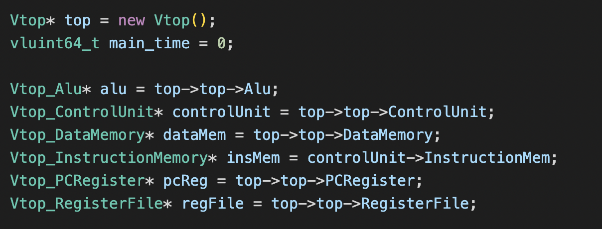

# Team-05 RISC-V CPU

## Table of Contents
1. [Directory Information](#1-directory-information)
   - [Repository Branch Descriptions](#10-repository-branch-descriptions) 
   - [Directory Organisation](#11-directory-organisation)
2. [Design Process](#2-design-process)
   - [Task Allocation](#21-task-allocation)
   - [Style and Naming](#22-style-and-naming)
   - [Note On Custom Logic Types](#23-note-on-custom-logic-types)
   - [Design Principles](#24-design-principles)
3. [About The CPU](#3-about-the-cpu)
   - [Overview](#31-overview)
   - [Single Cycle Architecture](#32-single-cycle-architecture)
   - [Pipelined Architecture](#33-pipelined-architecture)
   - [Demonstration](#34-demonstration)
   - [Pipelined Architecture with Data Cache](#35-pipelined-architecture-cache)
4. [Testing Bench](#4-testing-bench)
   - [Interfacing With The CPU](#41-interfacing-with-the-cpu)
   - [The Parser](#42-the-parser)
   - [Test Assembly Code](#43-test-assembly-code)
   - [F1 Assembly Code](#44-f1-assembly-code)
5. [Acknowledgements](#5-acknowledgements)

---

<br>

# (1) Directory Information


## (1.0) Repository Branch Descriptions : 

The tables below describes the usage of various branches for development and deployment purposes


**Table(1.0.1) :** Assessed/Deployment Repository Branches

---
| Branch |  Purpose | Verified Functionality |
|----------|-------------|----------|
| Single-Cycle-CPU  | Holds the files corresponding to the Single Cycle implementation of the CPU  |  Fully Tested and Verified|
| Pipelined-CPU    | Holds the files corresponding to the Pipelined version of the CPU that implements static branch prediction and hazard handling | Fully Tested and Verified|
|  Pipelined-CPU-With-Cache   | Holds the files corresponding to the Pipelined CPU with an additional Data Cache Implementation | Fully Tested and Verified| 
| main    | Holds repository information, documentation and evidence of results| |

---

<br>

## (1.1) Directory Organisation : 

Within the `doc` folder are subfolders for each team member and a diagram folder. The subfolders per team member hold their respective personal statement and additional documentation they have made.

**Branch : main**
```
root
├── doc/
│ ├── Diagrams/
│ ├── Dima/
| ├── Lolezio/
| ├── Meric/
| └── Sam/
├── README.md
```

**Branch : Single Cycle CPU**

Within the `rtl` folder are subfolders holding the `.sv` files that make up the given module. `Testing` holds the files used in testing the CPU. It contains subfolders that house the appropriate assembly programs. Each assembly program is built into a `.hex` file that are loaded into the instruction ROM - these files are housed in `Testing/HexFiles`

```
root

├── rtl/
| ├── Control/
| ├── Alu/
| ├── Memory
| ├── PC/
| ├── Mux/
| ├── include/
| |
| ├── buildCPU.sh
| ├── top.sv
| ├── top_tb.cpp
| ├── vbuddy.cfg
| └── buddy.cpp
|
├── Testing/
| ├── Assembly/
| ├── HexFiles/
| ├── Makefile
| └── format_hex.sh
|
└── README.md
```

**Branch : Pipelined CPU**

Within the `rtl` folder are subfolders holding the `.sv` files that make up the given module. `Testing` holds the files used in testing the CPU. It contains subfolders that house the appropriate assembly programs. Each assembly program is built into a `.hex` file that are loaded into the instruction ROM - these files are housed in `Testing/HexFiles`

```
root

├── rtl/
| ├── Alu/
| ├── Control/
| ├── HazardControl/
| ├── Memory/
| ├── PC/
| ├── Mux/
| ├── Old/
| ├── Pipelining/
| ├── include/
| ├── buildCPU.sh
| ├── top.sv
| ├── top_tb.cpp
| ├── vbuddy.cfg
| └── buddy.cpp
|
├── Testing/
| ├── Assembly/
| ├── HexFiles/
| ├── MemFiles/
| ├── Makefile
| └── format_hex.sh
|
└── README.md
```


**Branch : Pipelined CPU With Cache**


```
root

├── rtl/
| ├── Alu/
| ├── Control/
| ├── HazardControl/
| ├── Memory/
| ├── PC/
| ├── Mux/
| ├── Pipelining/
| ├── include/
| ├── buildCPU.sh
| ├── top.sv
| ├── top_tb.cpp
| ├── vbuddy.cfg
| └── buddy.cpp
|
├── Testing/
| ├── Assembly/
| ├── HexFiles/
| ├── MemFiles/
| ├── Makefile
| └── format_hex.sh
|
└── README.md
```


# (2) Design Process

## (2.0) Task Allocation

Below is an overview of contributions made to general module categories by the team members. A full module list per CPU version is available in `rtl/README.md` on their respective branch

| CPU Type             | Component            | Sub-Component     | Contributors               |
|----------------------|----------------------|-------------------|----------------------------|
| **Single Cycle CPU** | Arithmetic Logic Unit|                   | Sam Barber                 |
|                      | Control              |                   | Dima Askarov               |
|                      | Memory               | Instruction Memory| Dima Askarov               |
|                      |                      | Data Memory       | Dima Askarov               |
|                      |                      |                   | Lolézio Viora Marquet      |
|                      |                      | Register          | Dima Askarov               |
|                      |                      |                   | Sam Barber                 |
|                      | Multiplexers         | PC Mux            | Lolézio Viora Marquet      |
|                      |                      | Result Mux        | Lolézio Viora Marquet      |
|                      |                      | ALU Mux           | Sam Barber                 |
|                      | Program Counter      |                   | Lolézio Viora Marquet      |
|                      | Testing              |                   | Meric Song                 |
|                      |                      |                   | Lolézio Viora Marquet      |
| **Pipelined CPU**    | Pipelining           |                   | Lolézio Viora Marquet      |
|                      | Hazard Control       |                   | Dima Askarov               |
|                      | Testing              |                   | Meric Song                 |
|                      |                      |                   | Lolézio Viora Marquet      |
| **CPU with data cache**|                    |                   | Sam Barber                 |

<br>

## (2.1) Design Principles

The driving design principles throughout the development of components for the Single Cycle CPU and the Pipelined CPU were the following :

>- **Modularity** : Components were broken down into specialised units that performed a singluar or a limited set of tasks

>- **Ease of intergration and development** : The ability to easily integrate sub modules together was always a key consideration during design and development

>- **Transparency of operation** : The ability to easily interpret and understand the operation of modules and sub-modules was the main consideration when implementing them. The implications of this approach on the efficiency and cost of the design is explored in [Limitations, Reflections and Improvements](#5-limitations-reflections-and-improvements)

<br>

## (2.2) Style and Naming

In order to allow quick and clear development, naming conventions and styles were upheld throughout the design and development of modules. The naming conventions and styles used in this project are listed below

<br>

**Table (2.2.1)** : Style and Naming Conventions

---
| Subject |  Style/Naming Guide | Example |
|----------|-------------|----------|
| Module Names   | CamelCase and Pipeline Stage Identifier Suffix (To indicate in which pipeline stage the module operates $(F,D,E,M,W)$)  |  `ControlPathD` - Control Path Module in the Decode Stage|
| Input Signals     | CamelCase, Input Identifier Pre-Fix and Optional Pipeline Stage Operation Suffix |   `iInstructionTypeE` - An input of Instruction type from the execution stage  <br> `iClk` - Clock signal input|
| Output Signals    | CamelCase, Output Identifier Pre-Fix and Optional Pipeline Stage Operation Suffix  | `oRecoverPC` - Output Flag to Indicate Incorrect Branch <br> `oTakeJBD` - Output Flag into the Decode stage to indicate that a jump/branch has been taken  | 
| Internal Logic Signals    | Snake case with a Pipeline Stage Identifier Suffix (only in top sheet) | `instruction_type_e` - Type of Instruction Executing in the Execute Stage <br> `reg_data_in_w` - Data Written Back Into Register File From the Write-Back Stage | 
| Pipeline Register Naming| CamelCase with a Pipeline Stage Identifier Prefix and Suffix| `DPipelineRegisterE` - Pipeline Register Taking Signals From Decode Stage and Outputing Them Into The Execution Stage |

---

## (2.3) Note On Custom Logic Types

To increase the readability of modules and make their operation more transparent and understandable, frequently used control and data signals were encoded into custom logic types using enums and unions. 

These logic types are defined in the 'ControlTypeDefs.svh' file that is included in each module that utilises the respective logic types - shown in **Listing (1.2.1)**.

**Listing (2.3.1)** : Include header example

```verilog
`include "include/ControlTypeDefs.svh" //Include Header
```

<br>

**Table (2.3.1)** Shows the definition of the enum InstructionTypes. This enum was used to store the type of instruction executing as decoded by the control unit. Using this enum made the modules easier to understand as the viewer could easily tell what specific instruction would trigger a given set of outputs. 

**Table (2.3.2)** : Enum - InstructionTypes Definition

---
| InstructionTypes[3:0] |  Enum Value | Note |
|----------|-------------|----------|
| BRANCH   | 0000  | **Branch Instruction** (b-type)|
| LOAD     | 0001 | **Load Instruction** (i-type) |
| STORE    | 0010 | **Store Instruction** (s-type) | 
| UPPER    | 0011 | **Upper Instruction** (u-type)| 
| IMM_COMPUTATION | 0100 | **Register-Immediate Computation** : An instruction that performs logical/arithmetic operations on an immediate and register value | 
| REG_COMPUTATION | 0101 | **Register-Register Computation** : An instruction that performs logical/arithmetic operations on two register values  | 
| JUMP    | 0110 | **Jump Insturction** (j-type) | 
| NULLINS | 1111 | **NULL** : Used to represent 'no-instruction'. Helps determine when the decoding of a given isntruction word has failed |
---

<br>


To further classify a given instruction, a union InstructionSubType was implemented. At any given time, this union would take on the value of an enum type representing the specific instruction sub type. The definition of the 'TypeR' enum is shown in **Table (2.3.4)** as example. For the case of an r-type class of instructions, the InstructionSubTypes union would take on the enum value of the specific r-type instruction.

<br>

**Table (2.3.3)** : Enum - TypeR Definition

---
| TypeR[3:0] |  Enum Value | Note |
|----------|-------------|----------|
| ADD   | 0000  | **Register Addition** |
| SUB   | 0001 | **Register Subtraction** |
| SHIFT_LEFT_LOGICAL | 0010 | **Logical Shift Left** | 
| SET_LESS_THAN      | 0011 | **Set Less Than** | 
| USET_LESS_THAN     | 0100 | **Set Less Than Unsigned** |
| XOR | 0101 | **Bit-Wise XOR of Register Operands** | 
| SHIFT_RIGHT_LOGICAL | 0110 | **Logical Shift Right**  | 
| SHIFT_RIGHT_ARITHMETIC    | 0111 | **Arithmetic Shift Right** | 
| OR | 1000 |**Bit-Wise OR of Register Operands** |
| AND    | 1001 | **Bit-Wise AND of Register Operands** | 
| NULL_R    | 1111 |  **NULL** : Used to represent 'no-instruction'. Helps determine when the decoding of a given isntruction word has failed | 
---

<br>


**Table (2.3.4)** : Union - InstructionSubTypes Definition

---
| InstructionSubTypes[3:0] | Value |
|----------|----------|
| TypeR    | **Register-Register Instruction Type** |
| TypeI    | **Register-Immediate Instruction Type** |
| TypeU    | **Upper Instruction Type** | 
| TypeS    | **Store Instruction Type** | 
| TypeJ    | **Jump Instruction Type** |
| TypeB    | **Branch Instruction Type** | 
| NULL     | **NULL :** Helps determine when decoding the instruction sub type has failed  |  
---

<br>

**Listing(2.3.2) :** Example of instruction type and sub type assignment in InstructionDecode module given the instructin OpCode, funct3 and funct7 values

```verilog
  TypeR r_type;
  TypeI i_type;
  TypeU u_type;
  TypeS s_type;
  TypeJ j_type;
  TypeB b_type;

  InstructionTypes instruction_type;

always_comb begin
  case(iOpCode)

      7'd51 : begin
        instruction_type = REG_COMMPUTATION;
        
        i_type = NULL_I;
        u_type = NULL_U;
        s_type = NULL_S;
        j_type = NULL_J;
        b_type = NULL_B;
        
        case(iFunct3)

          3'b000  : begin
            if      (iFunct7 == 7'b0000000) r_type = ADD;
            else if (iFunct7 == 7'b0100000) r_type = SUB;
            else                            r_type = NULL_R;
          end

          3'b001  : r_type = SHIFT_LEFT_LOGICAL;
          3'b010  : r_type = SET_LESS_THAN;
          3'b011  : r_type = USET_LESS_THAN;
          3'b100  : r_type = XOR;
          
          3'b101  : begin
            if      (iFunct7 == 7'b0000000) r_type = SHIFT_RIGHT_LOGICAL;
            else if (iFunct7 == 7'b0100000) r_type = SHIFT_RIGHT_ARITHMETIC  ;
            else                            r_type = NULL_R;
          end

          3'b110  : r_type = OR;
          3'b111  : r_type = AND;    

        endcase
      end

  endcase
end
```

<br>

**Listing(2.3.4) :** Example usage of InstructionTypes enum and InstructionSubTypes union in producing control signals

```verilog
  always_comb begin

    //Initialise Output Signals
    oRegWrite   = 1'b0;
    oAluSrc     = 1'b0;
    oPCSrc      = 1'b0;
    oResultSrc  = 3'b000;
    oMemWrite   = 1'b0;

    case(iInstructionType)

      REG_COMMPUTATION : oRegWrite = 1'b1;


      IMM_COMPUTATION  : begin
        oRegWrite = 1'b1;
        oAluSrc   = 1'b1;
      end


      LOAD   : begin
        oRegWrite  = 1'b1;
        oResultSrc = 3'b001;
      end


      UPPER  : begin
        if (iInstructionSubType == LOAD_UPPER_IMM) begin
          oRegWrite  = 1'b1;
          oAluSrc    = 1'b1;
          oResultSrc = 3'b011;
        end

        else begin
          oResultSrc = 3'b100;  //Data written to register will come from the PC adder
          oPCSrc     = 1'b0;    //PC increments by 4
        end
      end
```

<br>


---

<br>

# (3) About The CPU

## (3.1) Overview

**Table(3.1.1) :** Implemented Instructions

---
| Instruction Type | Implemented Instructions|
|------------------|-------------------------|
| R-Type | Add, Sub <br> Logical Shift Left <br> Set Less Than, Set Less Than Unsigned <br> XOR <br> Shift Right Logical, Shift Right Arithmetic <br> OR  <br> AND  |
| I-Type | Load Byte, Load Half, Load Word <br> Load Byte Unsigned, Load Half Unsigned <br> Add Immediate <br> Logical Shift Left Immediate <br> Set Less Than Immediate, Set Less Than Immediate Unsigned <br> XOR Immediate <br> Shift Right Logical Immediate, Shift Right Arithmetic Immediate <br> OR Immediate <br> AND Immediate|
| U-Type | Load Upper Immediate <br> Add Upper Immediate PC |
| S-Type | Store Byte, Store Half, Store Word <br> Store Byte Unsigned, Store Half Unsigned|
| J-Type | Jump And Link <br> Jump And Link Register| 
| B-Type | Branch Equal To <br> Branch Not Equal To|

---

<br>

> *The decision to leave out the other branch instructions was made to reduce the complexity of the CPU. If accurate implementations of other branch instructions were to be made, like BGE, the use of additional flags that indicate arithmetic overflow may have been needed to determine the branch condition outcome.*

---

<br>


## (3.2) Single Cycle Architecture

Our implementation of the single cycle CPU is split in 5 main stages. 

**Table (3.2.1): Single Cycle Stages Overview** 

---

|      Stage      |  Operation | Relevant files |
|-----------------|----------------------------|-------------|
|      Fetch      | The Program Counter is incremented by the right amount, so that the correct next instruction is fetched |[PCAdder.sv](PCAdder.sv)   [PCRegister.sv](PCRegister.sv) [InstructionMemory.sv](InstructionMemory.sv)|
|      Decode   | The instruction is fully decoded to generate required control signals. During this stage the source registers are also read on the falling edge of the clock | [AluEncode.sv](AluEncode.sv) [ControlDecode.sv](ControlDecode.sv)  [ControlPath.sv](ControlPath.sv)  [ControlUnit.sv](ControlUnit.sv)  [ImmDecode.sv](ImmDecode.sv)  [InstructionDecode.sv](InstructionDecode.sv) [RegisterFile.sv](RegisterFile.sv) |
|     Execute   | The Arithmetic Logic Unit executes the computation specified by the instruction (includes no computation at all) | [Alu.sv](Alu.sv) |
|      Memory   | In the memory access stage the data memory is either read from or written to given the control signals in the memory stage| [DataMemory.sv](DataMemory.sv) |
|      Write    | The final result chosen between; the Alu output, memory data, Upper immediate, PC+4 and PC + Upper Immediate, is written to the register file on the rising edge of the clock| [ResultMux.sv](ResultMux.sv) |

---

<br>

### (3.2.1) Fetch Stage

### PC Register

The Fetch stage begins with the output of the next PC value, so that the next instruction can be fetched. This is implemented in [PCRegister.sv](PCRegister.sv) with the line:
```verilog
   if (iPCSrc == 1'b0) PCNext = iPCSrc ? iBranchTarget : oPC + 32'd4;
```
Depending on the value of PCSrc, the next PC value is either PC + 4 or PC + ImmExt (calculated as BranchTarget. PC + 4 would simply indicate the next instruction, since each 32 bit instruction word is stored in 8 memory locations, as seen below:

**Table (3.2.2): Memory Cell Structure**

---

| Cell 3 |  Cell  2 | Cell  1 | Cell  0 | Address |
|--------|----------|---------|---------|---------|
|8 bytes |  8 bytes | 8 bytes | 8 bytes |  0x004  |
|8 bytes |  8 bytes | 8 bytes | 8 bytes |  0x003  |
|8 bytes |  8 bytes | 8 bytes | 8 bytes |  0x002  |
|8 bytes |  8 bytes | 8 bytes | 8 bytes |  0x001  |
|8 bytes |  8 bytes | 8 bytes | 8 bytes |  0x000  |

---

The PC value maps to the address. When PC is 0, this will map to the first address, and the 4 bytes, forming one instruction word, will be outputted out of Instruction Memory. As such, PC + 4 corresponds to the next address.

<br>

###  PC Adder
When Jump or Branch instructions are carried out, the next instruction that must be carried out is not always the next one stored in memory. The next address must therefore be calculated, which is found using [PCAdder.sv](PCAdder.sv). 
<br>

The PC Adder receives the current instruction type from the Control Unit (see below), and executes the following logic:
<br>

**Table (3.2.3): PC Adder Logic** 

---
| Instruction Type |  Instruction SubType | Output PC Target |
|------------------|----------------------|------------------|
|  JUMP  |  JUMP AND LINK REGISTER      | ImmExt + RegOffset  | 
|  JUMP  |  ANY OTHER  | PC + ImmExt |
| BRANCH | ANY    | PC + ImmExt |

---

When the current instruction is a simple Branch or Jump, the next PC value is calculated by the value of ImmExt (see below), to give the correct next address. However, when the instruction is JALR, an offset can be specified. Since the value of this offset already contains the value of PC, ImmExt is once again added, so that the correct next address is found. 

<br>

### Instruction Memory

Instruction Memory was built to take in a PC value, corresponding to the address of the Instruction, and output it immediately, implemented in [InstructionMemory.sv](InstructionMemory.sv). It is not clocked, since PC Register already ensures that the value is for the correct clock cycle. 
<br>
The Read Only Memory (ROM) is implemented using the line:
```verilog
   logic [DATA_WIDTH - 1 : 0] rom_array [0 : 2**12  - 1];
```
The address space corresponding to the corresponding to the memory map in the brief, meaning up to 1024 instruction words can be loaded. This can however easily be extended.
<br>
The ROM outputs an instruction word, by concatenating the 4 individual bytes of the instruction word into a single, 32 bit value:
```verilog
   oInstruction = {rom_array[iPC + 32'd3][7:0], rom_array[iPC + 32'd2][7:0], rom_array[iPC + 32'd1][7:0], rom_array[iPC][7:0] };
```
<br>
This instruction is then decoded in the Control Unit.

### (3.2.2) Decode Stage

### Control Unit

The Control Unit was split into many smaller modules, to help with debugging and understanding the processes.

<br>

The instruction word out of Instruction Memory is first split into the Op Code and 2 Funct values, so that the Instruction Type and Subtype can be decoded. This is first done in [ControlPath.sv](ControlPath.sv)

<br>

To extract the correct data, the instruction outputted from Instruction Memory is simply indexed:
```verilog
always_comb begin
    op_code = iInstruction[6:0];
    funct7  = iInstruction[31:25];
    funct3  = iInstruction[14:12];
end
```

Additional logic also outputs the constant values to be stored in the Register file in this block (see below)

<br>

Next, the Operation Code, and Function 3 and 7 are passed into [InstructionDecode.sv](InstructionDecode.sv) so they can be decoded into the custom types (see above) InstructionType and InstructionSubType.

<br>

The following logic is implemented using a case statement, to determine the Instruction Type, in the Instruction Decoder. Decimal numbers are used as they are more readable:

<br>

**Table (3.2.4): Instruction Decode Logic** 

---

| OpCode |  Instruction Type     | Instruction Sub Type |
|--------|-----------------------|----------------------|
|  51    |  Register Computation | Depends on Funct3 and Funct7 |
|  19    | Immediate Computation | Depends on Funct3 and Funct7 |
| 3      | Load    | Depends on Funct3 |
| 23     | Upper | Add Unsigned PC |
| 55     | Upper | Load Unsigned Immediate |
| 103    | Jump | Jump and Link Register | 
| 111    | Jump | Jump and Link |
| 99     | Branch | Depends on Funct3 |
| 35     | Store  | Depends on Funct3 |

---

<br>

Once the Instruction Type is determined, for Register Computation, Immediate Computation, Load, Branch, and Store, the Instruction Sub Type is determined depending on Funct3 and Funct 7, with further case statements:

<br>

**Table (3.2.5): Register Computation** : 


---

| Funct3 |  Funct7    | Instruction Sub Type |
|--------|------------|----------------------|
|  000   |  0000000 | Add |
|  000   |  0100000 | Subtract |
|  001   |  Any     |Shift Left Logical|
|  010   |  Any     | Less Than |
|  011   |  Any     | Unsigned Less Than |
|  100   | Any      | XOR | 
|  101   | 0000000 | Shift Right Logical |
|  101   | 0100000 | Shift Right Arithmetic |
|  110     | Any  | OR |
|  111     | Any  | AND |

---

<br>

**Table (3.2.6): Immediate Computation**


---

| Funct3 |  Funct7    | Instruction Sub Type |
|--------|------------|----------------------|
|  000   |  Any | Add Immediate |
|  001   |  Any     | Shift Left Logical Immediate |
|  010   |  Any     | Less Than Immediate |
|  011   |  Any     | Unsigned Less Than Immediate |
|  100   | Any      | XOR Immediate | 
|  101   | 0000000 | Shift Right Logical Immediate |
|  101   | 0100000 | Shift Right Arithmetic Immediate|
|  110     | Any  | OR Immediate|
|  111     | Any  | AND Immediate |

---

<br>

**Table (3.2.7): Load**  


---

| Funct3 | Instruction Sub Type |
|--------|----------------------|
|  000   |  Load Byte |
|  001   |  Load Half Word |
|  010   |  Load Word |
|  100   |  Load Upper Byte | 
|  101   | Load Upper Half |

---

<br>

**Table (3.2.8): Branch** 


---

| Funct3 | Instruction Sub Type |
|--------|----------------------|
|  000   | Branch if Equal (BEQ) |
|  001   | Branch if not Equal (BNE) |
|  100   |  Branch if less than (BLT) |
|  101   |  Branch if greater or equal (BGE) | 
|  110   | Branch if less than unsigned (BLTU) |
|  111   | Branch if greater or equal than unsigned (BGEU) |

---

<br>

**Table (3.2.9): Store** 


---

| Funct3 | Instruction Sub Type |
|--------|----------------------|
|  000   | Store Byte |
|  001   | Store Half Word |
|  010   | Store Word |

---

<br>

Once the Instruction Type and Sub Type have been determined, the immediate operand must also be decoded, so it can be used by the ALU, or as a PC offset for Jump and Branch instructions. It is also sign extended, by setting all ImmExt[31:12] equal to the 12th bit ImmExt[11]. Once again, a case statement is used to determine this based on the Instruction Type determined previously, following this logic:

<br>

**Table (3.2.10): Immediate Decoder Logic** 


---

| Instruction Type | ImmExt |
|------------------|--------|
| Immediate Computation | Load Instruction[31:20] in ImmExt[11:0]|
|  Load   | Load Instruction[31:20] in ImmExt[11:0] |
|  Upper   | Set ImmExt[11:0] to 0, and load Instruction[31:20] in ImmExt[31:12] |
| Store    | Load Instruction[11:7] in ImmExt[4:0], Instruction[31:25] in ImmExt[11:5] |
| Jump and Link | Load Instruction[31:20] in ImmExt[11:0] | - Here, the offset will be calculated separately
| Jump | Set ImmExt[0] to 0, load Instruction[30:21] in Immext[10:1], load Instruction[20] in ImmExt[11], load Instruction[19:12] in ImmExt[19:12], and set ImmExt[31:20] to the value of Instruction[31] | - Setting ImmExt[0] ensures the address is a multiple of 2
|Branch | Set ImmExt[0] to 0, load Instruction [11:8] in ImmExt[4:1], concatenate Instruction[31], Instruction[7] and Instruction[30:25] in ImmExt[12:5], and set all ImmExt[31:13] to Instruction[31] | - Instruction already contains the location of the jump

---

<br>

Once the Immediate operand ImmExt has been determined, further control signals are determined in [ControlDecode.sv](ControlDecode.sv). This decoder once again comprises a case statement, looking at each Instruction type, and setting ResultSrc, AluSrc, RegWrite and MemWrite. They have the following purpose:

<br>

**Table (3.2.11): Control Signal Definitions**

---

| Control Signal | Purpose |
|--------|----------------------|
|  ResultSrc   | Determines which result is written back in the register file (see below) |
|  AluSrc   | Determines the source of the ALU inputs (see below) |
|  RegWrite   | Determines whether the register file must be written or not (see below) |
| MemWrite | Determines whether the data must be written to memory or not (see below) |

---

<br>

The case statement implementing these results implements the following logic:

<br>

**Table (3.2.12): Control Signal Encoder Logic**

---

| Instruction Type | ResultSrc |  AluSrc  |  RegWrite  | MemWrite |
|--------|----------------------|---------|------------|----------|
|  Register Computation   | 000 | 0 |  1 | 0 |
|  Immediate Computation   | 000 | 1 | 1 | 0 |
|  Load   | 001 | 1  | 1 | 0|
| Load Upper Immediate | 011 | 1 | 1 | 0 | 
| Upper | 100 | 0 | 0 | 0 |
| Store | 000 | 1 | 0 | 1 |
| Jump  | 010 | 0 | 1 | 0 | 

---

<br>

Finally, the Control Unit must determine what operations the ALU must conduct based on the Instruction type, but more importantly, the Sub Type, which is once again implemented using a case statement, with the following logic (in the implementation, the custom enum values corresponding to the operations were used, but for simplicity, here we have them in binary format):

<br>

> Note that the Instruction Sub Types, while being part of different Instruction Types, require the same ALU operations, and so here only the Sub Types are shown.

<br>

**Table (3.2.13): ALU Control Encoder Logic**

---

| Instruction Sub Type | AluCtrl |
|----------------------|---------|
| Add  | 0000 |
| Sub  | 0001 |
| Shift Left Logical  | 0010 |
| Set Less Than | 0011 |
| Unsigned Set Less Than | 0100 |
| XOR | 0101 |
| Shift Right Logical | 0110 |
| Shift Right Arithmetic | 0111 |
| OR | 1000 |
| AND | 1001 |

---

<br>

### Register File

In parallel to the signals being encoded and decoded, the Register file must be accessed, so that the data stored in it can be used by the ALU. A register is used here as the data is fast to access, making it convenient for a few variables, which is much better than accessing memory. In RISCV32I, the Register file contains 32 registers.

<br>

While in hardware, a register file is very different than a ROM or RAM, in SystemVerilog all three can be instantiated in a similar way:

```verilog
	logic [DATA_WIDTH-1:0] ram_array [0:2**ADDRESS_WIDTH-1];

```
<br>

The Read operation is made to be asynchronous, so data can immediately be accessed and passed to the ALU. The register file simply outputs the data stored at the given input address. An important note, however, is that in RISCV32I architecture, Register 0 is always set to 0, and cannot be written. This behavior is ensured by the line:

<br>

```verilog
	ram_array[0] = {DATA_WIDTH{1'b0}};
```
<br>

Register A0 is set to be the output register, which is implemented with the line:

```verilog
	oRega0    = ram_array[5'd10];
```
<br>

> Note that A0 is register x10 in the Register File, as consistent with RISC-V Register Naming conventions

<br>

Finally, the register file can be written, on the negative falling edge of the clock:

```verilog
always_ff @ (negedge iClk) begin
        if(iWriteEn == 1'b1) ram_array[iWriteAddress] <= iDataIn;
    end
```
It is written on the falling edge so that data can be written and read very soon thereafter, ensuring that no cycles are wasted when retrieving data from the register file.

<br>

---

### (3.2.3) Execute Stage

### Arithmetic Logic Unit (ALU)

Since the ALU controls AluCtrl was already encoded in the Decode stage, the implementation of the ALU is quite simple, following the same logic as in the ALUEncode section of the Control Unit above, but in reverse. The ALU takes in 2 operands, AluOp1 and AluOp2, and performs the arithmetic operation encoded by ALuCtrl.

<br>

AluOp1 and AluOp2 are determined in the Top file [top.sv](top.sv) directly, which removes the need for an additional Mux module (which was originally implemented and later removed). They are implemented by the following:

```verilog
always_comb begin
        alu_op1 = reg_data_out1;
        alu_op2 = alu_src ? imm_ext : reg_data_out2 ; //Pick between immediate or register operand
    end
```
<br>

This implements the following logic:

**Table (3.2.14): ALU Source Logic**

---

| AluSrc | AluOp1 | AluOp2 | 
|---------|---------|---|
| 1  | ImmExt | RegData1  |
| 0  | RegData2 | RegData1|

---

<br>

Once AluOp1 and AluOp2 are determined, [Alu.sv](Alu.sv) implements the following logic with a case statement:

**Table (3.2.15): ALU Operation Logic**

---

| AluCtrl | Operation | Note |
|---------|---------|-----|
| 0000 | AluOp1 + AluOp2 | Addition |
|0001 | AluOp1 - AluOp2 |  Subtraction | 
| 0010 | AluOp1 << AluOp2 | Left shift |
|  0011 | AluOp1 > AluOp2 | Set Less Than |
|  0100 | AluOp1 > AluOp2 | Unsigned Set Less Than |
|  0101 |AluOp1 ^ AluOp2 | Bitwise XOR |
| 0110 | AluOp1 >> AluOp2 | Right Shift Logical |
| 0111 | AluOp1 >>>> AluOp2 | Right Shift Arithmetic |
| 1000 | AluOp1 | AluOp2 | Bitwise OR |
|  1001 | AluOp1 & AluOp2 | Bitwise AND |

---

<br>

Additional logic is also implemented in the ALU, namely to set the Zero flag:

**Table (3.2.16): Zero Flag and AluResult Logic**

---

| Operation Outcome | Zero | AluResult |
|---------|---------|-----|
| 0 | 1 | 0 |
|Any |0  |  Operation Outcome | 

---

### (3.2.4) Memory Stage

### Data Memory

The Data Memory is instantiated to be Random Access Memory (RAM) with the line:
```verilog
logic [31:0] mem_array [2**ADDRESS_WIDTH - 1 : 0];
```
<br>

The given address to be read (output from the ALU) is not necessarily aligned to the words stored in memory, so they must be aligned with the line:
```verilog
word_aligned_address = {{iAddress[31:2]}, {2'b00}};
```
> Note that the RAM is organised in the same way as the Instruction Memory ROM. As such, each data word starts at an address that is a multiple of 4.

However, since this would make the exact data location be lost within the words, the offset is saved as well:
```verilog
byte_offset          = iAddress[1:0];
```
<br>

A case statement then determines what must be read or written, depending on the Instruction Type:

**Table (3.2.17): Data Memory Logic**

---

| Instruction Type | Type of Operation | Operation |
|---------|---------|-----|
| Store Byte | Write Operation | Store Input MemData[7:0] in memory at given address |
|Store Half Word |Write Operation  |  Store Input MemData[15:0] in memory at given address | 
| Store Word | Write Operation | Store Input MemData in memory at given address |
| Load Byte | Read Operation | Load Output MemData[7:0] with value at given address, and sign extend |
| Load Half Word | Read Operation | Load Output MemData[15:0] with value at given address, and sign extend |
| Load Word | Read Operation | Load Output MemData with value at given address |
| Unsigned Load Byte | Read Operation | Load Output MemData[7:0] with value at given address, and zero extend |
| Unsigned Load Half Word | Read Operation | Load Output MemData[15:0] with value at given address, and zero extend |

---

<br>

> Note that read operations are always carried out, however, whether the memory is actually written is determined by the control signal WriteEn. When it is true, the memory is written.

<br>

### (3.2.5) Write Stage

### Result Multiplexer
The final stage of the CPU simply determines what must be written back to the register file, following the control signal ResultSrc determined in the Control Unit. 
<br>

The following logic is implemented by a final case statement in [ResultMux.sv](ResultMux.sv):

**Table (3.2.18): Result Multiplexer Logic**

---

| ResultSrc |   RegDataIn       | Operation |
|-----------------|----------------|-------------|
| 000   | AluResult  | Result of ALU Operation stored in Register file |
| 001   | MemDataOut | Read data from memory  |
| 010   | PC + 4 | Jump, so return address must be stored | 
| 011   | UpperImm | Load Upper Immediate | 
| 100 | PC + UpperImm | Store PC with offset | 

---

<br>

With all the stages fully implemented, the Single Cycle Processor is fully functional. However, it remains inefficient, and to calculate the Probability Distribution Functions with large amounts of data, a more efficient processor was developed, by implementing first pipelining, and then data cache.


---

<br>

**Diagram (3.2.19): High Level Diagram of Single CPU**

## (3.3) Pipelined Architecture

As with the Single Cycle Architecture, the pipeline architecture broke down the instruction execution cycle into 5 stages. The stages were chosen as the following : 

**Table (3.3.1)** : Pipeline Stages

---
| Pipe Line Stage |   Name       | Operation |
|-----------------|----------------------------|-------------|
| $F/D_{jb}$   | $Fetch/Decode \ Jump -Branch$  | The instruction is fetched and partly decoded to determine if a branch or jump type (only JAL) instruction is executing. In the case of a branch or jump the required control signals are generated (ie. setting $PC = JTA$) |
| $D$     | $Decode$ | The instruction is fully decoded to generate required control signals. During this stage the source registers are also read on the falling edge of the clock |
| $E$    | $Execute$ | The Arithmetic Logic Unit executes the computation specified by the instruction (includes no computation at all) | 
| $M$    | $Memory$ | In the memory access stage the data memory is either read from or written to given the control signals in the memory stage| 
| $W$ | $Write \ Back$ | The final result chosen between; the Alu output, memory data, Upper immediate, PC+4 and PC + Upper Immediate, is written to the register file on the rising edge of the clock| 

---


**Table (3.3.2)** : Relevant Modules

---
| Module |   Description       |
|-----------------|----------------------------|
| `HazardUnit`   | Used to detect data and control hazards and produce flush/stall and forward signals  | 
| `OperandForwarderD`     | This module forwards registers that are to be compared in a branch instruction in the case of data hazard. | 
| `ComparatorD`    | This module compares the values of the two registers used in a branch instruction. It also detects incorrect branch prediction and generates the required control signals|  | 
| `AluOpForwarderE`    | This module forwards data from the memory/writeback stage to the execution stage in the case of data hazard. | 
| `JumpBranchHandlerF` |This module makes the decision to branch given the type of branch executing, and generates the control signals for jump instructions in the fetch stage | 
---


<br>

<br>

>*Note that the JALR instruciton is dealt with in the main $DECODE$ stage and only the JAL instruction is resolved in the $F/D_{jb}$ stage.* 

>*This is because, if $JALR$ was to be decoded and acted upon in the $F/D_{jb}$ stage, then a data dependancy between the previous instruction and the $JALR$ source register would require further forwarding all the way back to the $F/D_{jb}$ stage - instead of adding additional hardware and complexity, the choice of leaving $JALR$ for the main $DECODE$ stage was made.* 

>*This means however, that for every $JALR$ instructions, the decode stage has to be flushed and the $JTA$ instruction has to be fetched (giving a waste in a cycle)*

---

<br>

## Key Features

### Hazard Handling


#### Load Data Dependency
- **Issue**: If a load instruction is in the Execute stage (`iInstructionTypeE == LOAD`), and its destination register matches a source register in the Decode stage, a data hazard occurs.
- **Resolution**: The Fetch, Decode, and Execute stages are stalled, and the Execute stage is flushed.

#### Branch Instructions (RAW Hazards)
- **Issue**: Occurs when an instruction in the Decode stage is dependent on the result of an instruction in the Memory stage.
- **Resolution**: Forwarding is applied if there is no load instruction in the Memory stage. If there is a load, the Fetch, Decode, and Execute stages are stalled, and the Execute stage is flushed.

#### General RAW Hazards
- **Issue**: Occurs when a source register in the Execute stage is about to be written in the Memory or Write Back stages.
- **Resolution**: Data is forwarded from the Memory or Write Back stage to the Execute stage.

<br>

#### Forwarding Logic

   | Instruction Stage | Forwarding Condition | Action |
   |-------------------|----------------------|--------|
   | Execute           | Source register in Execute matches destination in Memory/Write Back | Data is forwarded to prevent stall |
   | Decode            | Source register in Decode matches destination in Memory | Data is forwarded for comparison operations |


#### Stall and Flush Logic

   | Instruction Stage | Forwarding Condition | Action |
   |-------------------|----------------------|--------|
   | Execute           |**Load Dependancy :** The instruction in the Execute stage is a load, and it writes to either one of the source registers in the Decode stage  | Pipeline is stalled at the Fetch and Decode stages, and the Execute stage is flushed to avoid using incorrect data. |
   | Decode            | **Branch Data Dependancy :** For branch instructions in the Decode stage, if either of the two source registers are to be written to by an instruction in the Executin stage, | Pipeline is stalled, and the Execute stage is flushed on the next cycle. This gives time for the instruction previously in the Execution stage to reach the Memory stage where the output of the Execution stage can be forwarded to the Decode stage.|

---


<br>

### Static Branch Prediction
---

In an attempt to reduce the CPI of the pipelined CPU and increase its efficiency, the choice to implement static branch prediction was made. 

<br>

> **Static Branch Prediction :** The CPU will always take the branch if it is to be taken backward (ie. the branch target address is less than the current address). This can improve the processors' performance as 'for' and 'while' loops, which are blocks of code that execute many times, are typically implemented using a branch instruction, thus in a programme utilising loops, the probability that a given branch instruction will indeed branch backwards is higher than the inverse. 

>This means if you predict a branch outcome before the decode stage such that backward branches are always taken, you can save many clock cycles that would be used to flush out the incorrectly fetched instructions.

<br>

To accomodate for static branch prediction, a part of the instruction had to be decoded within the fetch stage to determine if its a branch or jump.

In the case of a branch that is to be taken backwards, the module `JumpBranchHandlerF` would create the branch target address using the current PC value in the fetch stage and the instruction word.


#### Edge Cases and Stalls

In the case that the branch taken backwards resolves to be incorrect (ie. branch was taken backward when it should not have been), the `ComparatorD` module will detect the incorrect prediction by comparing the two source registers of the branch instruction within the main $DECODE$ stage - alongside additional information on the branch prediction made in the fetch stage.

**Listing() :** Example in `ComparatorD` of incorrect branch prediction detection based on the value of source registers and branch decision in the previous stage

```verilog
  case(iInstructionTypeD)

    BRANCH : begin

      case(iJBTypeD)

        BEQ : begin

         // If registers are equal and we didnt take the branch
          if      (iRegData1D == iRegData2D & iTakeJBD == 1'b0) begin 
            oPCSrcD    = 1'b1;
            oFlushD    = 1'b1; 
            oRecoverPC = 1'b0; 
          end 

         // If registers aren't equal and we did take the branch
          else if (iRegData1D != iRegData2D & iTakeJBD == 1'b1) begin 
            oPCSrcD    = 1'b1;
            oFlushD    = 1'b1; 
 //If we have branched when we were not supposed to -> must recover PC of instruction after BEQ
            oRecoverPC = 1'b1;
          end

//This covers the registers being equal and branch being taken or registers being not equal and branch not taken
          else begin 
            oPCSrcD    = 1'b0;
            oFlushD    = 1'b0;
            oRecoverPC = 1'b0;
          end
          
        end
```

## 


## (3.4) Demonstration

This section documents the results of reference programs and the F1 lighting sequence program on the different CPU architectures

### (3.4.1) Hazard Handling and Forwarding 

The images below document the following assembly code being run on the pipelined CPU :
**Listing ()**
```assembly
_loop2:                     # repeat
    LI      a4, max_count   # PC = 48
    ADD     a5, a1, a2      # PC = 52   a5 = data base address + offset
    LBU     t0, 0(a5)       # PC = 56   t0 = data value
    ADD     a6, t0, a3      # PC = 60   a6 = index into pdf array
    LBU     t1, 0(a6)       # PC = 64   t1 = current bin count
    ADDI    t1, t1, 1       # PC = 68   increment bin count
    SB      t1, 0(a6)       # PC = 72   update bin count
    ADDI    a2, a2, 1       # PC = 76   point to next data in array
    BNE     t1, a4, _loop2  # PC = 80   until bin count reaches max
    RET                     # PC = 84
```

In the code above, there are data dependancies between the following instructions : 
- `ADD a5, a1, a2` and `LBU t0, 0(a5)`: 
  -  The `LBU` instruction uses `a5` as an operand, which is set by the preceding `ADD` instruction. This is a Read After Write (RAW) hazard, as `LBU` reads the value of `a5` immediately after it's written.

<br>

- `LBU t0, 0(a5)` and `ADD a6, t0, a3`: 
  - The `ADD` instruction uses `t0`, which is loaded by the preceding `LBU` instruction. This is another RAW hazard, as `ADD` requires the value in `t0` that `LBU` has just loaded.

<br>

- `ADD a6, t0, a3` and `LBU t1, 0(a6)`: 
  - The `LBU` instruction uses `a6` as an operand, which is calculated by the preceding `ADD` instruction. This is again a RAW hazard.

<br>

- `LBU t1, 0(a6)` and `ADDI t1, t1, 1`: 
  - The `ADDI` instruction modifies `t1`, which holds the value loaded by the preceding `LBU` instruction. This is a RAW hazard as `ADDI` needs the value from `LBU`.

<br>

- `ADDI t1, t1, 1` and `SB t1, 0(a6)`: 
  - The `SB` (store byte) instruction uses the value in `t1` that was just modified by `ADDI`. This is another RAW hazard.

<br>


<br>

**The simulation image below shows the following pipeline state :** 

| Stage | Instruction | PC |
|-------|-------------|----|
| $Fetch/Decode$ | `LBU t1, 0(a6)`|  64  |
| $Decode$ | `ADD a6, t0, a3`|  60  |
| $Execute$ | `LBU t0, 0(a5)`|  56  |
| $Memory-Access$ | `ADD a5, a1, a2`|  52  |
| $Write-Back$ | `LI a4, max_count`|  48  |

<br>

**Figure(3.4.1(1)) :** Stall and Flush Demonstration


<br>

As the instruction in the decode stage is being decoded (`ADD a6, t0, a3`), the hazard unit detects its' dependancy with the load instruction in the Execute stage - as a result it sets the stall and flush flags to allow some time for the load instruction to propagate to the write-back stage, where the result can be forwarded. The logic performing this is shown below : 

<br>

```verilog
    if (iInstructionTypeE == LOAD) begin 
      if (iDestRegE == iSrcReg1D | iDestRegE == iSrcReg2D) begin //Load Dependancy Detected
        oStallF = 1'b1;
        oStallD = 1'b1;
        oFlushE = 1'b1; e
      end  
    end
```

This is seen happenening in **Figure(3.1.1(1))**, where the `oStallF`, `oStallD` and `oFlushE` are output as high from the hazard unit - with the the execution stage being flushed on the next clock cycle (PC and all other signals go to 0)

In the same cycle, the hazard unit also detects the dependancy between the `ADD a5, a1, a2` in the Memory stage and `LBU t0, 0(a5)` in the Execute stage. **Figure(3.1.1(1))** shows the `iForwardAluOp1` being set to $01$ in binary - indicating that the destination registster in the memory stage is the same as the source 1 register in the execute stage. The logic that performs this in the `HazardUnit` is shown below :


**Listing ()**
```verilog
      //If destination register in memory stage is the same as source1 register in execution stage
      if      (iSrcReg1E != 5'b0 & iRegWriteEnM & iDestRegM == iSrcReg1E) begin
        if (iInstructionTypeM != UPPER) oForwardAluOp1E = 2'b01;
        else                            oForwardAluOp1E = 2'b11;    //Forward writeback value to execution stage
      end

      else if (iSrcReg1E != 5'b0 & iRegWriteEnW & iDestRegW == iSrcReg1E) begin
        if (iInstructionTypeM != UPPER) oForwardAluOp1E = 2'b10;
        else                            oForwardAluOp1E = 2'b11; 
      end

      else                              oForwardAluOp1E = 2'b00;    //If there is no data dependancy hazard for source register 1

      //If destination register in memory/writeback stage is the same as source register in execution stage
      if      (iSrcReg2E != 5'b0 & iRegWriteEnM & iDestRegM == iSrcReg2E) oForwardAluOp2E = 2'b01;     
      else if (iSrcReg2E != 5'b0 & iRegWriteEnW & iDestRegW == iSrcReg2E) oForwardAluOp2E = 2'b10;     
      else 
```

As a result, the `alu_op1_e` (alu operand 1 in the execute stage) is equal to 65538 (decimal) which is the value that is about to be written to `ram_array[15]` (register 15 - a5) on the next clock cycle (its' current value is 0)

---

<br>

**The simulation image below shows the following pipeline state :**

| Stage | Instruction | PC |
|-------|-------------|----|
| $Fetch/Decode$|`LBU t1, 0(a6)`| 64 |
| $Decode$ | `ADD a6, t0, a3`|  60  |
| $Execute$ | `NULL`|  0  |
| $Memory-Access$| `LBU t0, 0(a5)`|  56  |
| $Write-Back$| `ADD a5, a1, a2`|  52  |

<br>

**Figure(3.4.1(2)) :** Forwarding and Flushing Demonstration 1


**Figure(3.4.1(2))** shows the `LBU t0, 0(a5)` in the Memory stage. At this point the data memory is accessed with the correct address shown by `iAddress`. In the same cycle, `oMemData` holds the value of `byte1` that has been zero extended (unsigned load). Note how the execution stage is flushed in this cycle.

<br>

**The simulation image below shows the following pipeline state :**

| Stage | Instruction | PC |
|-------|-------------|----|
| $Fetch/Decode$|`ADDI t1, t1, 1`| 68 |
| $Decode$ | `LBU t1, 0(a6)`|  64  |
| $Execute$ | `ADD a6, t0, a3`|  60  |
| $Memory-Access$| `NULL` |  0  |
| $Write-Back$| `LBU t0, 0(a5)`|  56  |

<br>

**Figure(3.4.1(3)) :** Forwarding and Flushing Demonstration 2


<br>

Now the `LBU t0, 0(a5)` instruction has reached the Write Back stage where the value of `t0` can be forwarded to the Execute stage so that the instruction `ADD a6, t0, a3` uses the correct value of `t0`.

**Figure(3.4.1(3))** shows the `iForwardAluOp1` being set to 2 (decimal) indicating that the result in the Write Back stage should be forwarded.

---

<br>

### (3.4.2) Branch Prediction and Correction

Below are simulation results demonstrating branch prediction and incorrect branch correction.

Below is the assembly code that was loaded into ROM and simulated

**Listing ()**

```verilog
main:
    JAL     ra, init            # PC = 0    jump to init, save return address in ra
    JAL     ra, build           # PC = 4
forever:
    JAL     ra, display         # PC = 8
    J       forever             # PC = 12

init:                           # function to initialise PDF buffer memory 
    LI      a1, 0x100           # PC = 16   loop_count a1 = 256
_loop1:                         # repeat
    ADDI    a1, a1, -1          # PC = 20   decrement a1
    SB      zero, base_pdf(a1)  # PC = 24 mem[base_pdf+a1] = 0
    BNE     a1, zero, _loop1    # PC = 28   until a1 = 0
    RET                         # PC = 32
```
<br>

**The simulation image below shows the following pipeline state :**

| Stage | Instruction | PC |
|-------|-------------|----|
| $Fetch/Decode$|`BNE a1, zero, _loop1`| 28 |
| $Decode$ | `SB zero, base_pdf(a1)`|  24  |
| $Execute$ | `ADDI a1, a1, -1`|  20  |
| $Memory-Access$| `BNE a1, zero, _loop1` |  28  |
| $Write-Back$| `SB zero, base_pdf(a1)`|  24  |

<br>

**Figure (3.4.2(1)) :** Incorrect Branch Decision


**Figure (3.4.2(1))** shows a branch instruction in the Fetch stage of the pipeline (`BNE a1, zero, _loop1`). Given that this branch is backwards to `_loop1`, it is automatically taken in the Fetch stage, as shown by the `oTakeJBF` flag.

However, the branch condition of `a1` and `zero` being not equal to would no longer be met in the next clock cycle. This is because the value of `a1/ram_array[11]` is $1$ in this clock cycle, and the instruction `ADDI a1, a1, -1` is currently being computed in the Execute stage.

This data dependancy and incorrect branch decision are resolved once the branch instruction reaches the Decode stage.

<br>

Once the branch instruction reaches the Decode stage, the instructions' source registers are compared by the `ComparatorD` module and the branch outcome is resolved.

In the case of a data dependancy with the previous instruction, the hazard unit detects this and outputs the forwarding logic signal. The dependant register value is forwarded via the `OperandForwarderD` module to the `ComparatorD` for comparison. 

Using the flag values `iTakeJBF` and `iTakeJBD` the comparator decides if the branch taken in the fetch stage was correct or not. The PC recovery logic is shown below:

**Listing ()** : PC Recovery Logic for BEQ instruction

```verilog
  case(iInstructionTypeD)

    BRANCH : begin

      case(iJBTypeD)

        BEQ : begin
        // If registers are equal and we didnt take the branch
          if      (iRegData1D == iRegData2D & iTakeJBD == 1'b0) begin 
            oPCSrcD    = 1'b1;
            oFlushD    = 1'b1; 
            oRecoverPC = 1'b0; 
          end 

  // If registers aren't equal and we did take the branch
  //If we have branched when we were not supposed to -> must recover PC of instruction after BEQ

          else if (iRegData1D != iRegData2D & iTakeJBD == 1'b1) begin 
            oPCSrcD    = 1'b1;
            oFlushD    = 1'b1;
            oRecoverPC = 1'b1; 
          end
```

**The simulation image below shows the following pipeline state :**


| Stage | Instruction | PC |
|-------|-------------|----|
| $Fetch/Decode$| `ADDI a1, a1, -1`|  20  |
| $Decode$|`BNE a1, zero, _loop1`| 28 |
| $Execute$ | `SB zero, base_pdf(a1)`|  24  |
| $Memory-Access$ | `ADDI a1, a1, -1`|  20  |
| $Write-Back$| `BNE a1, zero, _loop1` |  28  |


<br>

**Figure (3.4.2(2)) :** PC Recovery and Branch Correction


**Figure (3.4.2(2))** shows the PC value in the Fetch stage going from $20$ *(incorrectly fetched branch target)* to $32$ *(instruction after the branch)*. In this clock cycle, the comparator sets the `oRecoverPC` flag high, the PC register uses this information to output the value of the PC in the Decode stage plus four as shown in **Listing()**. 

Note how the decode stage is also flushed to prevent the incorrectly fetched instruction to propagate through the pipeline

**Listing () :** PC Recovery in `PCRegisterF`

```verilog
  always_comb begin
    //Must first check that the branch outcome in decode stage 
    //If we didnt branch when we needed to and the instruction in fetch is a backward branch, we should not execute the backward branch
    if (iPCSrcD == 1'b0) PCNext = iPCSrcF ? iBranchTarget : oPC + 32'd4;
    else                 PCNext = iTargetPC;
  end
```

Furthermore, given the dependancy of the `a1` register on the `ADDI` instruction prior to the branch, the hazard unit also outputs control signals to forward the Alu output from the memory stage to the `CompratorD` module in the Decode stage.

**Figure (3.4.2(3)) :** JALR Execution


<br>

**Figure (3.4.2(3))** shows the simulation in **Figure(3.4.2(2))** one clock cycle later. The PC value in the fetch stage is $32$ indicating a JALR (RET) instruction. Note how the `TakeJB` flags aren't set during this fetch stage. This is due to JALR being decoded fully in the decode stage as discussed earlier (in general, for JALR, the `TakeJB` flags aren't generated, instead the computed jump target is fed into `PCNext` using `PCSrcD` signals). 

Also note how the Decode stage is flushed in this cycle to prevent the incorrectly fetched instruction with `PC` of $36$ from propagating through the pipieline

<br>

**Figure (3.4.2(4)) :** JALR Execution 2


<br>

**Figure (3.4.2(4))** shows the pipeline 1 cycle later, the `PC` in the Fetch stage is 4, which the value stored in `ram_array[1] / reg x1` representing the RET address that was set at the start of the program execution (`JAL ra, init`) 

Given that the RET address was to another `JAL` instruction, the `TakeJBF` flag is set high in this cycle indicating that a jump to `build / PC = 36` is being  made. 

<br>

**Figure (3.4.2(5)) :**


<br>

**Figure (3.4.2(5))** shows the `JAL` instruction with `PC = 4` in the write back stage. At this point, the return address must be stored in `ram_array[1]` which is shown to be storing the value 8 in decimal. This would be the `PC` of the instruction after the `JAL ra, build` (with PC = 4). 


### (3.4.3) PDF Generation - Pipeline

The Processor was tested using the reference programs provided, to calculate the Probability Density Function (PDF) for 4 different datasets. The Formula 1 Lights Program was also tested. All tests were carried out on the Pipelined Processor, to decrease the number of cycles needed to run the programs.


### (3.4.4) Sine PDF


https://github.com/lolzio5/Team05-RISCV-Final/assets/71973875/2c81f9f9-d959-4b91-a68d-f022c468aa8f


Reading the data from Data Memory in the Pipelined Processor, the PDF of the Sine function was plotted on Vbuddy. This shows the correct expected output, and that the Pipelined CPU was effectively able to evaluate the PDF, after a large number of cycles. 

> To run the Sine PDF, navigate to the Pipelined with Cache Branch, open the ```rtl``` folder, and enter the command
>  ```
> source ./buildCPU.sh
> ```
> Make sure that in [InstructionMemory.sv](InstructionMemory.sv) line 24 is set to
> ```verilog
> $readmemh("pdf.hex", rom_array);
> ```
> And that in [DataMemory.sv](DataMemory.sv) line 38 is set to
> ```verilog
>  $readmemh("sine.hex", mem_array, 20'h10000);
> ```

<br>

### (3.4.5) Gaussian PDF

https://github.com/lolzio5/Team05-RISCV-Final/assets/71973875/42672676-5b34-4a91-95da-944a255f6978

Reading the data from Data Memory in the Pipelined Processor, the PDF of the Gaussian function was plotted on Vbuddy. This shows the correct expected output, and that the Pipelined CPU was effectively able to evaluate the PDF, after a large number of cycles. 

> To run the Gaussian PDF, navigate to the Pipelined with Cache Branch, open the ```rtl``` folder, and enter the command
>  ```
> source ./buildCPU.sh
> ```
> Make sure that in [InstructionMemory.sv](InstructionMemory.sv) line 24 is set to
> ```verilog
> $readmemh("pdf.hex", rom_array);
> ```
> And that in [DataMemory.sv](DataMemory.sv) line 38 is set to
> ```verilog
>  $readmemh("gaussian.mem", mem_array, 20'h10000);
> ```

<br>

### (3.4.6) Noisy PDF


https://github.com/lolzio5/Team05-RISCV-Final/assets/71973875/4f05f4a5-ad61-4ae5-8489-99a86ba0dc33


Reading the data from Data Memory in the Pipelined Processor, the PDF of the Noisy function was plotted on Vbuddy. This shows the correct expected output, and that the Pipelined CPU was effectively able to evaluate the PDF, after a large number of cycles. 

> To run the Noisy PDF, navigate to the Pipelined with Cache Branch, open the ```rtl``` folder, and enter the command
>  ```
> source ./buildCPU.sh
> ```
> Make sure that in [InstructionMemory.sv](InstructionMemory.sv) line 24 is set to
> ```verilog
> $readmemh("pdf.hex", rom_array);
> ```
> And that in [DataMemory.sv](DataMemory.sv) line 38 is set to
> ```verilog
>  $readmemh("noisy.mem", mem_array, 20'h10000);
> ```

<br>

### (3.4.7) Triangle PDF


https://github.com/lolzio5/Team05-RISCV-Final/assets/71973875/b90bb138-215e-406c-88d7-dc71be8c0d0b


Reading the data from Data Memory in the Pipelined Processor, the PDF of the Triangle function was plotted on Vbuddy. This shows the correct expected output, and that the Pipelined CPU was effectively able to evaluate the PDF, after a large number of cycles. 

> To run the Triangle PDF, navigate to the Pipelined with Cache Branch, open the ```rtl``` folder, and enter the command
>  ```
> source ./buildCPU.sh
> ```
> Make sure that in [InstructionMemory.sv](InstructionMemory.sv) line 24 is set to
> ```verilog
> $readmemh("pdf.hex", rom_array);
> ```
> And that in [DataMemory.sv](DataMemory.sv) line 38 is set to
> ```verilog
>  $readmemh("triangle.mem", mem_array, 20'h10000);
> ```

<br>

---

### (3.4.8) F1 Lighting Sequence - Pipeline

https://github.com/lolzio5/Team05-RISCV-Final/assets/71973875/b585d13c-0146-4a05-a419-959e3aec0845


The F1 lights were made to gradually turn on, with constant time interval in between, until all are on. Then, after a random amount of time, they turn off, and the process repeats itself. As can be seen on the video, they turn on gradually in the same manner each time, but they turn off after a different interval each time. This makes it difficult to predict when they will turn off, and showcases that both the F1 program was written correctly, and that the CPU is working correctly.

> To run this test on the Single Cycle CPU, navigate to the Single Cycle Branch, open the ```rtl``` folder, and enter the command
> ```
> source ./buildCPU.sh F1.hex
> ```

<br>

> To run this test on the Pipelined CPU, navigate to the Pipelined with Cache Branch, open the ```rtl``` folder, and enter the command
> ```
> source ./buildCPU.sh
> ```
> Make sure that in [InstructionMemory.sv](InstructionMemory.sv) line 24 is set to
> ```verilog
> $readmemh("F1.hex", rom_array);
> ```

<br>

---

## (3.5)  Pipelined Architecture with Data Cache
### Direct Mapped Cache 
The cache is implemented using a direct mapped approach.  The cache memory is made up of 4 parts valid bit, tag, index and data. The cache size is 64 bytes with a tag size of 26 bits and Index size of 4 bits. This is implemented with 3 separate ram arrays for the cache data, valid bit and tag of the cache. 

### (3.5.1) Hit
A hit is detected when the incoming read iAddress tag matches the tag of the cache and the valid bit is high. When a hit occurs data is read directly from cache.

### (3.5.2) Miss
If a miss is detected data must be read from main memory. It is then stored in the cache so allow at the corresponding index.

### (3.5.3) Writing to memory
When an address stored  within the cache is written to the cache must be cleared to prevent the information in the cache from being out of date. This is achieved by setting the valid bit low on the cache block when iWriteEn is high for the corresponding cache.


## (4) Testing Bench

To ensure that the CPU was fully correct, an intensive test was carried out on each instruction, checking whether their behavior was what is expected, or not.

### (4.1) Interfacing With The CPU.

By adding /*verilator public*/ metacomments into module systemVerilog files and adding —public flag to the compile command, Verilator will create extra header files for us to access internal signal values via testbench program, which get updated when the top module is evaluated each clock cycle. 


Example of the metacomment; you only need to include it once per module sv files.



Accesing modules’ internal signal values in testbench.


Example of instruction test functions by checking internal signal values, and making early 

This testbench simulates and verifies each clock cycle of the CPU by parsing the assembly file being fed into the CPU’s instruction memory and comparing its expected behaviour to the actual behaviour.

### (4.2) The parser:

The parser is mainly composed of the following functions: 

```cpp
void readAssemblyFile(const std::string& filename)
void parseAssembly()
void handleInstruction(const std::string& line)
```

Some smaller functions that take care of specific parsing operations that were written as a function for improvement in code readability and maintainability, will not be mentioned in this documentation.

**Listing() :** readAssemblyFile:

```cpp
void readAssemblyFile(const std::string& filename) {
    std::ifstream file(filename);
    std::string line;
    int lineNumber = 0;

    while (std::getline(file, line)) {
        std::string instruction;

        // Read only up to the '#' character
        std::istringstream iss(line);
        std::getline(iss, instruction, '#');
        instruction = rtrim(instruction);

        std::istringstream iss_instruction(instruction);
        std::string firstToken;
        iss_instruction >> firstToken;

        if (firstToken.empty() || firstToken == ".text") {
            continue; // Skip empty lines or lines that become empty after removing comments
        }

        if (firstToken == ".equ") {
            parseAndAddConstant(instruction); // Handle .equ directive
            continue;
        }

        if (firstToken.back() == ':') {
            firstToken.pop_back(); // Remove colon
            labelMap[firstToken] = lineNumber;
        } else {
            instructions.push_back(instruction);
            lineNumber++;
        }
    }
}
```

The readAssemblyFile reads each line of the assembly file stream and appropriately handles/parses each line into global variables that are defined within the testbench.

1. The parser will ignore any comments made using ‘#’ string.
2. The parser will trim any trailing whitespaces that exist due to comments.
3. The parser will ignore empty lines or comment lines, or .text label.
4. The parser will handle .equ directive and allocate constant values for the program.
5. The parser will handle labels by putting it into unordered map named labelMap. This come in handy when parsing jump instructions.
6. The parser will then consider anything else as instruction and will push it back into a string vector named instructions.
7. The index of each instruction inside the instructions vector will represent PC divided by 4 inside instruction memory, and labels will also have address associated with it.

**Listing() :** Parse-Assembly

```cpp
void parseAssembly() {
    while (programCounter < instructions.size()) {
        if(programCounter == 0) {
            reset();
        }
        else {
            tick();
        }
        checkAndPrintLabel(labelMap, programCounter);
        handleInstruction(instructions[programCounter]);
    }
}
```

This function will run through the instructions vector and feed each instructions into the **handleInstruction()** function. It is also responsible for simulating tick and reset in the cpu clock for each instructions being ran inside the CPU.

**Listing() :** handleInstruction:

```cpp
void handleInstruction(const std::string& line) {
    std::istringstream iss(line);
    std::string instr;
    iss >> instr; // Extract the instruction mnemonic
    std::transform(instr.begin(), instr.end(), instr.begin(), 
                   [](unsigned char c) { return std::tolower(c); });

    std::vector<std::string> args;
    std::string arg;

    while (iss >> arg) {
        if (arg.find('#') != std::string::npos) {
            // This argument is a comment, stop processing further
            break;
        }
        args.push_back(arg); // Extract arguments
    }

    if (instr == "bne") {
        if (args.size() != 3) {
            std::cerr << "Error: Invalid arguments for 'bne'" << std::endl;
            return;
        }

        int reg1 = getRegisterAddress(args[0]);
        int reg2 = getRegisterAddress(args[1]);
        int branchAddr = getJumpAddress(args[2]) * 4;
        if (testBNE(reg1,reg2,branchAddr,line)) {
            programCounter = branchAddr / 4;
        }
        else {
            programCounter++;
        }
    } 

    else if (instr == "beq") {
        if (args.size() != 3) {
            std::cerr << "Error: Invalid arguments for 'beq'" << std::endl;
            return;
        }

        int reg1 = getRegisterAddress(args[0]);
        int reg2 = getRegisterAddress(args[1]);
        int branchAddr = getJumpAddress(args[2]) * 4;
        if (testBEQ(reg1,reg2,branchAddr,line)) {
            programCounter = branchAddr / 4;
        }
        else {
            programCounter++;
        }
    } 

    else if (instr == "li") {
        if (args.size() != 2) {
            std::cerr << "Error: Invalid arguments for 'li'" << std::endl;
            return;
        }

        int reg1 = getRegisterAddress(args[0]);
        int immVal = parseStringToInt(args[1]);

        testLI(reg1, immVal, line);

        programCounter++;
    }

		// ... more instructions handled below
}
```

Here each line of instructions will be further parsed, and handled.

Each arguments inside the instruction line is parsed into register values, or immediate values, or etc depending on context, and is fed into test function for checking if each instructions are being ran properly each cycle of the CPU.

In result, we get the verification of CPU by compiling and running the Verilator executable! 

### (4.3) Test Assembly Code

Below is the test assembly code for our single cycle CPU, and its result:

```nasm
main:
    addi    t0, zero, 2    # Initialize t0 with 10
    addi    t1, zero, 0      # Initialize t1 with 0 (loop counter)

loop:
    addi    t1, t1, 1        # Increment t1
    sll     t2, t1, 1        # Shift left logical t1 by 1, store in t2
    xor     t3, t2, t1       # XOR t2 and t1, store in t3
    bne     t1, t0, loop     # If t1 is not equal to t0, branch to loop

    jal     ra, func         # Jump to func, store return address in ra

    jal     ra, end

func:
    addi    t4, zero, 5      # Initialize t4 with 5
    jalr    zero, ra, 0      # Return to the address in ra

end:
    addi    t0, zero, 1000
```


### (4.4) F1 Assembly Code

F1Single.s below was run, and tested 

```nasm
main:
    addi    a0, zero, 0x0                       # load a0 with 0 (a0 is vbd_value, the output)
    addi    t1, zero, 0x0FF
    addi    a2, zero, 0x000 
    addi    a3, zero, 0x001
    addi    a4, zero, 0x000
    addi    a5, zero, 0x001
    jal     x0, loop                            # Jump to loop

loop:
    addi    t0, zero, 0x00F                     # load t0 with a large number to be counted down
    sll     a0, a0, 1                           # shift a0 by 1 so it goes up sequentially in decimal
    addi    a0, a0, 1                           # increment a0 by 1
    beq     a0, t1, random_time                 # If a0 is 255, turn off after a random time
    jal     x0, constant_time                   # Jump to constant_time

constant_time:
    addi    t0, t0, -1                          # Decrement t0
    beq     t0, zero, loop                      # If t0 is equal to zero, return to loop
    jal     x0, constant_time                   # Else continue looping

random_time:
    jal     ra, random_logic                    # Calculate the random value to be decremented
    addi    s1, s1, -1
    beq     s1, zero, end                       # If s1 is equal to zero, end the program
    jalr    x0, ra, 0                           # Else continue looping from the adding statement

random_logic:
    addi    s1, zero, 0x0
    add     s1, s1, a2
    sll     a3, a3, 0x001
    add     s1, s1, a3
    sll     a4, a4, 0x001
    add     s1, s1, a4
    sll     a5, a5, 0x001
    add     s1, s1, a5
    xor     a2, a4, a5
    jalr    x0, ra, 0                           # Return to random_time, 1 instruction later

end:
    addi    a0, zero, 0x0
```


As seen above, the parser and test functions test the CPU line-by-line and see if it can run any assembly instructions thrown at it, and results in expected behaviour each CPU cycle. If all cycles run as expected, the CPU is “verified”.

<br>


# (5) Acknowledgements

*The successful design and development of the various CPU architectures documented here would not have been possible without the generous help and advice of the Undergraduate Teaching Assistants for the 2023-24 Instruction Architectures And Compilers course and notably, Professor Peter Y.K Cheung. A great amount of design choices were influenced by Professor [Peter Y.K Cheungs' lectures](http://www.ee.ic.ac.uk/pcheung/teaching/EIE2-IAC/) and the book 'Digital Design And Computer Architecture` - by David Money Harris & Sarah L. Harris*

