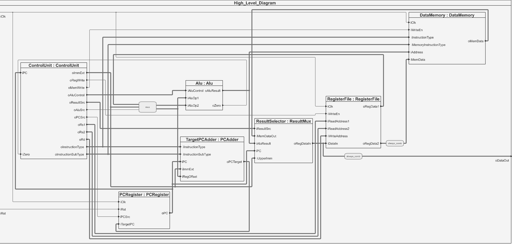
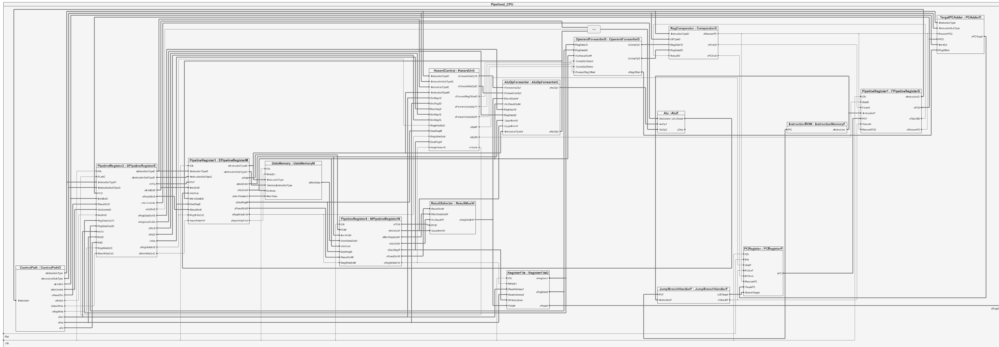
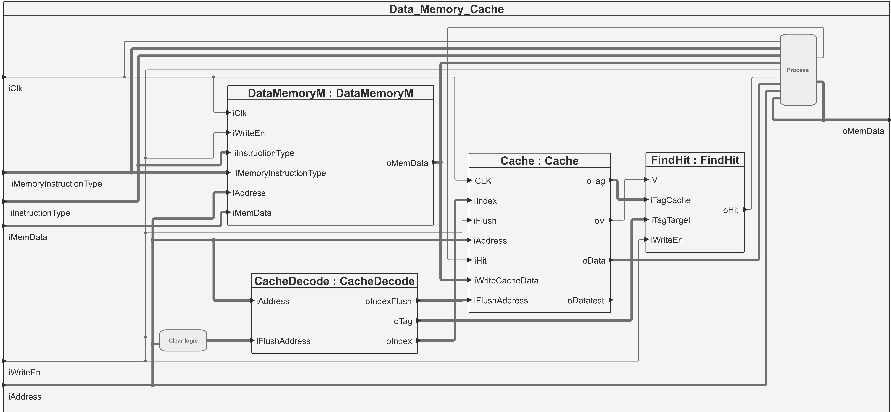
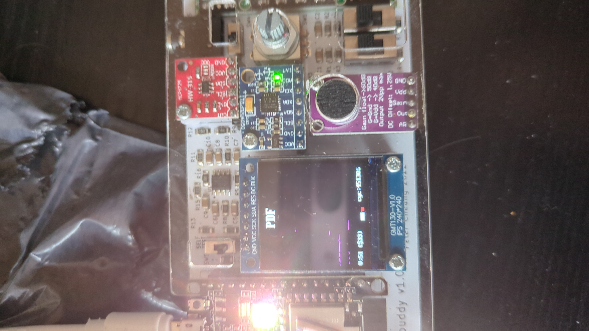

## Statement of Personal Contributions

Sam Barber - Team 5: Risk V 32i Processor Project

1. [ALU](#alu)
2. [Register](#register)
3. [Processor Diagram](#diagram)
     - [Single cycle diagram](#hit)
     - [Pipelined single cycle diagram](#hit)
     - [Cached and pipelined](#hit)
4. [Top File](#top)
5. [Assembly](#assembly)
6. [Cache](#cache)
     - [Hit decetion](#hit)
     - [Miss handling](#miss)
     - [Decode module](#decode)
     - [Writing to memory and replacement policy](#writing)
8. [Conclusion and Reflection](#conclusion)

## ALU 

The ALU module is module designed to perform various arithmetic and logical operations on two input operands based on a control signal. It supports a variety of operations including addition, subtraction, left shift, right shift (logical and arithmetic), set less than, set less than (unsigned), XOR, OR, and AND. The module is parameterized to allow customisation of the operation and data width.

Dima and I worked together to determind what instuctions where required and how they would be impliamented by the ALU and Control Path. Below is a table showing the various control inputs for the ALU from the Control unit:

 

| Control Signal | Operation                | Description                                      |
| --------------- | ------------------------ | ------------------------------------------------ |
| `4'b0000`       | Addition (`iAluOp1 + iAluOp2`)      | Adds the two input operands.                     |
| `4'b0001`       | Subtraction (`iAluOp1 - iAluOp2`)   | Subtracts the second operand from the first.     |
| `4'b0010`       | Left Shift (`iAluOp1 << iAluOp2`)   | Left-shifts the first operand by the second operand number of bits. |
| `4'b0011`       | Set Less Than (`iAluOp1 < iAluOp2`) | Sets `oAluResult` to 32'b0 if the first operand is less than the second, otherwise 32'b1. |
| `4'b0100`       | Unsigned Set Less Than (`iAluOp1 < iAluOp2`) | Sets `oAluResult` to 32'b0 if the first operand is less than the second (unsigned), otherwise 32'b1. |
| `4'b0101`       | XOR (`iAluOp1 ^ iAluOp2`)          | Performs bitwise XOR on the two operands.       |
| `4'b0110`       | Right Shift Logical (`iAluOp1 >> iAluOp2`) | Right-shifts the first operand by the second operand number of bits (logical shift). |
| `4'b0111`       | Right Shift Arithmetic (`iAluOp1 >>> iAluOp2`) | Right-shifts the first operand by the second operand number of bits (arithmetic shift). |
| `4'b1000`       | OR (`iAluOp1 \| iAluOp2`)         | Performs bitwise OR on the two operands.        |
| `4'b1001`       | AND (`iAluOp1 & iAluOp2`)         | Performs bitwise AND on the two operands.       |

 
The ALU also has a zero output which indicates if the result is zero. High when result is zero.

### Inputs
iAluControl: Control signal specifying the operation to be performed.
iAluOp1: First input operand.
iAluOp2: Second input operand.
 
### Outputs
oAluResult: Result of the operation.
oZero: Indicates whether the result is zero.

## Register 
The register file has 1 write port and 3 read ports. Two of the read ports can read any address and the other always reads a0. The register is built on a ram array additionally there is logic implemented to prevent the zero register from being changed from zero. Data is written to the register on the positive edge and read on the negative edge.

## Processor Diagram 
As the processor got more complicated and we deviated from the supplied diagram it became much more difficult to understand how each of our modules linked together. To help with this I created diagrams using sigasi to show how the modules interfaced with each other on a high level. 

### Single cycle diagram 
This diagram shows how individual modules of the single cycle processor interface with each other.

### Pipelined single cycle diagram 
This diagram shows how individual modules of the pipelined processor interface with each other.

## Top File 

My contribution to the top file was to implement all the modules I wrote into the top file. Along with altering the top file to resolve errors found after I created the high level diagram above.

## Assembly 
In order to test the functionality of the ALU I had written I wrote some assembly to test all the functions of the ALU in the CPU. The test was successful and verified that all the ALU operations where working as indented after it was implemented in CPU.
## Direct mapped Cache 
I chose to implement the cache using a direct mapping with a cache size 16 blocks this meant the cache size was 64 bytes. To achieve this I chose a tag size of 26 bits and Index size of 4 bits. This is implemented with 3 separate ram arrays for the cache data, valid bit and tag of the cache. Below is a diagram showing how the data memory modules are connected and operate.

### Hit Detection and handling 
A hit is detected by the module FindHit.sv. If on the positive edge of a clock cycle iWriteEn in low, both iTagCache and iTagTarget match and the cache block is valid iV a hit will be detected. 

Next the Hit signal is passed to the DataMemoryController.sv and the data is retrieved from the cache. This retrieved data is formatted based on the value of iMemoryInstructionType and the byte_offset. Utilising Dima's customed enum instuciton definitions. This determines whether how it should be formatted show in the table below. This mimics the functionality of the existing Data Memory. 
| iMemoryInstructionType  | Description                                       |
|------------------------------------|----------------------------------------------|
| LOAD_BYTE                     | Based on the byte offset the selected byte will be written to oMemData. Then a sign extension is  performed to fill in the other 24 bits.        |
| LOAD_HALF                    | Based on the byte offset the selected 2 bytes will be written to oMemData. Then a sign extension is  performed to fill in the other 16 bits.       |
| ULOAD_BYTE                     | Based on the byte offset the selected byte will be set as the oMemData. Then sign extension is  performed to fill in the other 24 bits.        |
| ULOAD_HALF                    | Based on the byte offset the selected 2 byte will be written to oMemData. Then zero extension is  performed to fill in the other 16 bits.       |
| LOAD_WORD                    | All 4 bytes are written to oMemData.      |
| default                   | For the default case a LOAD_WORD operation is performed.      |

### Miss Handling 
If a miss is detected the data must be loaded from main memory. To achieve this DataMemoryController.sv passes the 
### Decode Module 
The decode module is very simple it splits the incoming address into its Index and tag
### Writing to memory and Replacement policy 
When an address stored  within the cache is written to the cache must be cleared to prevent the information in the cache from being out of date. This is achieved by setting the valid bit low on the cache block when iWriteEn is high for the corresponding block of cache.

Every time a miss occurs 
### Testing the cache
Testing with the PDF program on the pipelined single cycle processor with data memory cache.

Testing with the Triangle PDF program on the pipelined single cycle processor with data memory cache.

## Two way cache 
The two way cache is build 
### Writing to memory and Replacement policy 
## Conclusion and Reflection 

Overall I was happy with how the project went 

If I was doing the project again I would have intergrated the cache witht the main CPU much sooner rather than relying on my own testing of the module by itself. As this resulted in If I have additonal time I would have also like to persue adding levels of caching to the process to improve the Data Memory efficency. In addition I think it would have made the module intergation much simplier if we had agreed on a naming convention at the start of the project rather than altering all our code after the fact to fit a naming conventsion.
